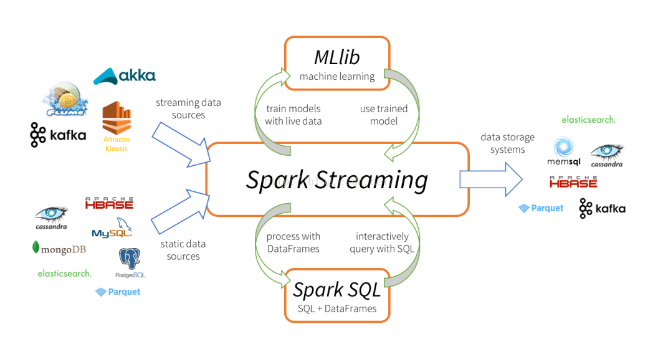

###### Spark简介

[TOC]

# 什么是Spark？

Apache Spark 是专门为大规模数据处理而设计的快速通用的计算分析引擎

Spark是UC Berkeley AMP lab （加州大学伯克利分校的AMP实验室）所开源的类Hadoop MapReduce 的通用并行计算框架，Spark拥有Hadoop MapReduce所具有的优点；但不同于MapReduce的是Job中间输出结果可以保存在内存中，从而不在需要读写HDFS，因此Spark能更好的适用于数据挖掘与机器学习等需要迭代的MapReduce算法。

Spark是Scala语言编写，方便快速编程。

[Spark官网](http://spark.apache.org/docs/2.3.1/)

# Spark特点

1. 快速
    ‎Apache Spark 使用最先进的 DAG 调度器、查询优化器和物理执行引擎，为批量和流式传输数据实现高性能。‎
2. 易用
    Spark 提供 80 多个高级算子，便于构建并行应用。您可以从Java、Scala、Python、R 和 SQL ‎‎交互式使用‎‎它。‎
3. 通用
    ‎Spark 为一叠库提供动力，包括‎‎SQL 和DataFrames、用于机器学习的‎‎MLlib、GraphX‎‎和‎‎Spark Streaming。 ‎‎您可以在同一应用程序中无缝地将这些库组合在一起。‎
4. 到处运行
    Spark可以运行在standalone cluster mode（独立集群模式）、EC2、Hadoop YARN、Mesos、 Kubernetes上；访问HDFS、Alluxio、Apache Cassandra、Apache HBase、Apache Hive和其他数据源中的数据
    
    
# Spark技术栈

# Spark和MapReduce的区别
都是分布式计算框架，Spark基于内存，MR基于HDFS。
Spark处理数据的能力一般是MR的十倍以上，Spark中除了基于内存计算外，还有DAG有向无环图来切分任务的执行先后顺序。

# Spark运行模式
- Local

    多用于本地测试，如在eclipse，idea中写程序测试等。
- Standalone

    Standalone是Spark自带的一个资源调度框架，它支持完全分布式。
    
- Hadoop YARN

    Hadoop生态圈里面的一个资源调度框架，Spark也是可以基于Yarn来计算的。
    
- Mesos

    资源调度框架。

> 要基于Yarn来进行资源调度，必须实现AppalicationMaster接口，Spark实现了这个接口，所以可以基于Yarn。

###### THANKS

