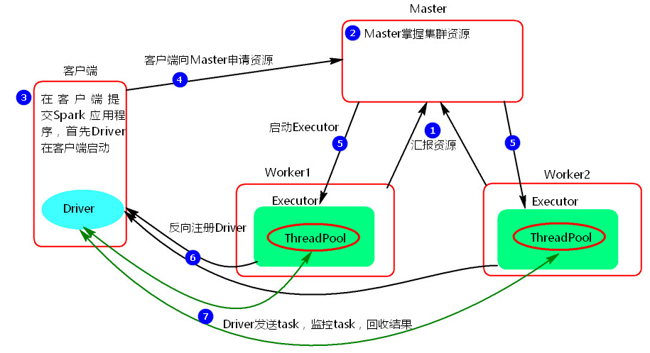
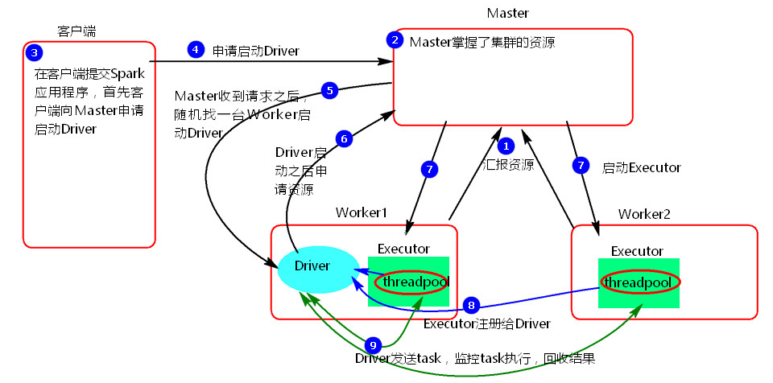
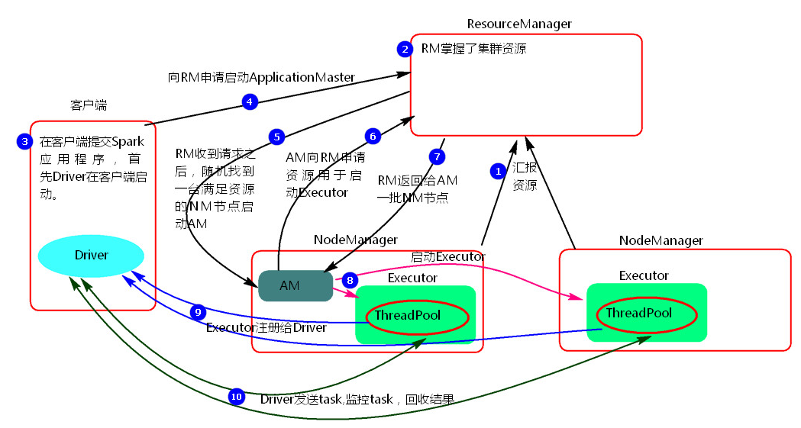
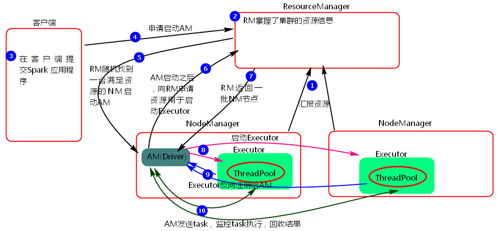

# 1. Spark基于Standalone模式提交任务

Standalone模式两种提交任务方式

## 1.1 Standalone-client提交任务方式

### 1.1.1 提交命令

```shell script
./spark-submit --master spark://mynode1:7077  
--class org.apache.spark.examples.SparkPi ../examples/jars/spark-examples_2.11-2.3.1.jar 100
```

或者

```shell script
./spark-submit --master spark://mynode1:7077 
--deploy-mode client  
--class org.apache.spark.examples.SparkPi ../examples/jars/spark-examples_2.11-2.3.1.jar 100
```

### 1.1.2 执行原理图解



### 1.1.3 执行流程
1. client模式提交任务后，会在客户端启动Driver进程。
2. Driver会向Master申请启动Application启动的资源。
3. Master收到请求之后会在对应的Worker节点上启动Executor
4. Executor启动之后，会注册给Driver端，Driver掌握一批计算资源。
5. Driver端将task发送到worker端执行。worker将task执行结果返回到Driver端。


### 1.1.4 总结
client模式适用于测试调试程序。Driver进程是在客户端启动的，这里的客户端就是指提交应用程序的当前节点。

在Driver端可以看到task执行的情况。生产环境下不能使用client模式，是因为：假设要提交100个application到集群运行，Driver每次都会在client端启动，那么就会导致客户端100次网卡流量暴增的问题。

client模式适用于程序测试，不适用于生产环境，在客户端可以看到task的执行和结果

## 1.2 Standalone-cluster提交任务方式

### 1.2.1 提交命令
```shell script
./spark-submit --master spark://mynode1:7077 
--deploy-mode cluster
--class org.apache.spark.examples.SparkPi ../examples/jars/spark-examples_2.11-2.3.1.jar 100
```

### 1.2.2 执行原理图解


### 1.2.3 执行流程
1. cluster模式提交应用程序后，会向Master请求启动Driver.
2. Master接受请求，随机在集群一台节点启动Driver进程。
3. Driver启动后为当前的应用程序申请资源。
4. Driver端发送task到worker节点上执行。
5. worker将执行情况和执行结果返回给Driver端。

### 1.2.4 总结
Driver进程是在集群某一台Worker上启动的，在客户端是无法查看task的执行情况的。

假设要提交100个application到集群运行,每次Driver会随机在集群中某一台Worker上启动，那么这100次网卡流量暴增的问题就散布在集群上。

## 1.3 总结Standalone两种方式提交任务

Driver与集群的通信包括：
1. Driver负责应用程序资源的申请
2. 任务的分发。
3. 结果的回收。
4. 监控task执行情况。

## 2. Spark基于Yarn模式提交任务

Yarn模式两种提交任务方式

## 2.1 yarn-client提交任务方式

### 2.1.1 提交命令
```shell script
./spark-submit 
--master yarn
--class org.apache.spark.examples.SparkPi ../examples/jars/spark-examples_2.11-2.3.1.jar 100
```
或者
```shell script
./spark-submit 
--master yarn-client
--class org.apache.spark.examples.SparkPi ../examples/jars/spark-examples_2.11-2.3.1.jar 100 
```
或者
```shell script
./spark-submit 
--master yarn 
--deploy-mode  client 
--class org.apache.spark.examples.SparkPi ../examples/jars/spark-examples_2.11-2.3.1.jar 100
```

### 2.1.2 执行原理图解



### 2.1.3 执行流程
1. 客户端提交一个Application，在客户端启动一个Driver进程。
2. 应用程序启动后会向RS(ResourceManager)发送请求，启动AM(ApplicationMaster)的资源。
3. RS收到请求，随机选择一台NM(NodeManager)启动AM。这里的NM相当于Standalone中的Worker节点。
4. AM启动后，会向RS请求一批container资源，用于启动Executor.
5. RS会找到一批NM返回给AM,用于启动Executor。
6. AM会向NM发送命令启动Executor。
7. Executor启动后，会反向注册给Driver，Driver发送task到Executor,执行情况和结果返回给Driver端。

### 2.1.4 总结
Yarn-client模式同样是适用于测试，因为Driver运行在本地，Driver会与yarn集群中的Executor进行大量的通信，会造成客户机网卡流量的大量增加.

### 2.1.5 ApplicationMaster的作用

1. 为当前的Application申请资源
2. 给NameNode发送消息启动Executor。

**注意：ApplicationMaster有launchExecutor和申请资源的功能，并没有作业调度的功能。**

## 2.2 yarn-cluster提交任务方式
### 2.2.1 提交命令
```shell script
./spark-submit 
--master yarn 
--deploy-mode cluster 
--class org.apache.spark.examples.SparkPi ../examples/jars/spark-examples_2.11-2.3.1.jar 100
```
或者
```shell script
./spark-submit 
--master yarn-cluster
--class org.apache.spark.examples.SparkPi ../examples/jars/spark-examples_2.11-2.3.1.jar 100
```

### 2.2.2 执行原理图解



### 2.2.3 执行流程
1. 客户机提交Application应用程序，发送请求到RS(ResourceManager),请求启动AM(ApplicationMaster)。
2. RS收到请求后随机在一台NM(NodeManager)上启动AM（相当于Driver端）。
3. AM启动，AM发送请求到RS，请求一批container用于启动Executor。
4. RS返回一批NM节点给AM。
5. AM连接到NM,发送请求到NM启动Executor。
6. Executor反向注册到AM所在的节点的Driver。Driver发送task到Executor。

### 2.2.4 总结
Yarn-Cluster主要用于生产环境中，因为Driver运行在Yarn集群中某一台nodeManager中，每次提交任务的Driver所在的机器都是随机的，不会产生某一台机器网卡流量激增的现象，缺点是任务提交后不能看到日志。只能通过yarn查看日志。

### 2.2.5 ApplicationMaster的作用

1. 为当前的Application申请资源
2. 给NameNode发送消息启动Excutor。
3. 任务调度。

### 2.2.6 停止集群任务
停止集群任务命令：yarn application -kill applicationID