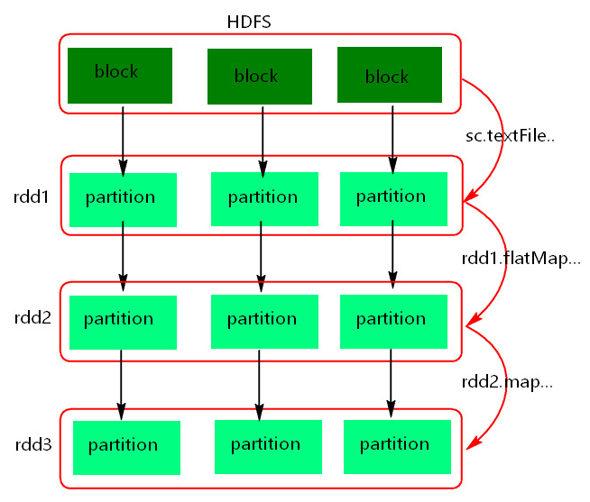
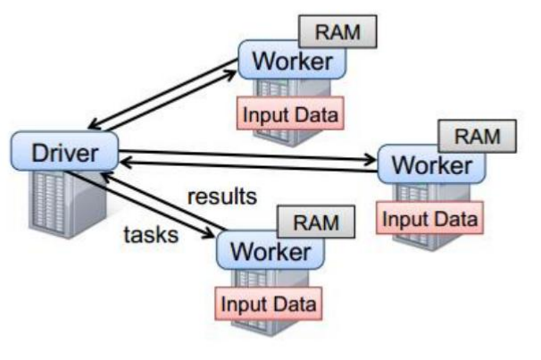
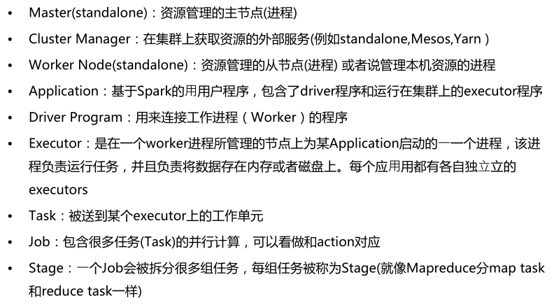
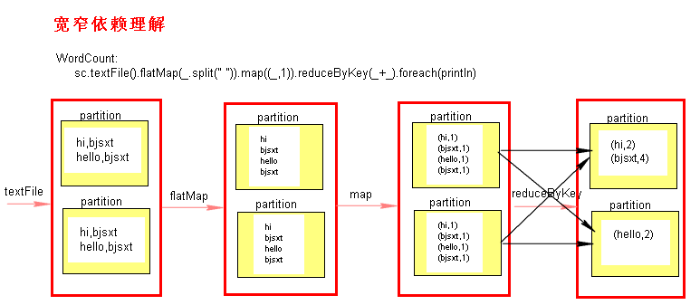
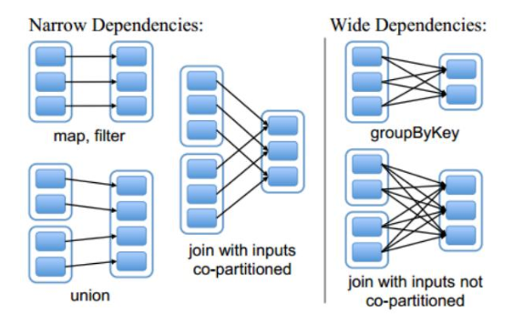
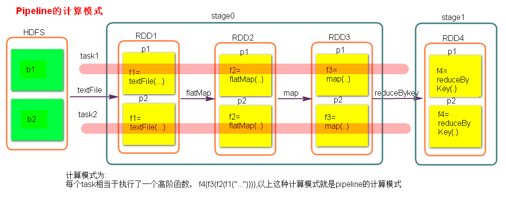

Spark Core

# 1. RDD

## 1.1 概念

RDD(Resilient Distributed Dateset)，弹性分布式数据集。

## 1.2 RDD的五大特性

1. RDD是由一系列的Partition组成的
2. 函数（算子）是作用在每一个Partition（Split）上的
3. RDD之间有一系列的依赖关系
4. 分区器是作用在K，V格式的RDD上
5. RDD提供一系列最佳的计算位置

## RDD理解图


**注意：**

1. textFile方法底层封装的是读取MR读取文件的方式，读取文件之前先split，默认split大小是一个block大小。

2. RDD实际上不存储数据

3. 什么是K,V格式的RDD

    如果RDD里面存储的数据都是二元组对象，那么这个RDD我们就叫做K,V格式的RDD。
    
4. 哪里体现了RDD的弹性（容错）？

    - Partition数量，大小没有限制，体现了RDD的弹性
    - RDD之间有依赖关系，可以基于上一个RDD重新计算出RDD
   
5. 哪里体现RDD的分布式？
    
    RDD是由Partition组成，partition是分布在不同节点上的
    

# 2. 创建RDD的方式

```java
javaSparkContext.textFile(String path,int minPartitions);
javaSparkContext.parallelize(List<T> list, int numSlices);
javaSparkContext.parallelizePairs(List<Tuple2<K,V>> list, int numSlices);
```

```scala
sparkContext.textFile(path: String,minPartitions: Int)
sparkContext.parallelize(list: List<T>, numSlices: Int)
sparkContext.parallelizePairs(list: List<Tuple2<K,V>>, numSlices:Int)
```

# 3. Spark任务执行原理



以上图中有四个机器节点，Driver和Worker是启动在节点上的进程，运行在JVM中的进程。

- Driver与集群节点之间有频繁的通信。
- Driver负责任务(tasks)的分发和结果的回收。任务的调度。如果task的计算结果非常大就不要回收了。会造成oom。
- Worker是Standalone资源调度框架里面资源管理的从节点。也是JVM进程。
- Master是Standalone资源调度框架里面资源管理的主节点。也是JVM进程。


# 4. Spark算子

# 4.1 Transformations转换算子

Transformations类算子是一类算子（函数）叫做转换算子，如map,flatMap,reduceByKey等。

Transformations算子是延迟执行，也叫懒加载执行。

- filter

    过滤符合条件的记录数，true保留，false过滤掉。

- map
    
    将一个RDD中的每个数据项，通过map中的函数映射变为一个新的元素。
    
    特点：输入一条，输出一条数据。

- flatMap
    
    先map后flat。与map类似，每个输入项可以映射为0到多个输出项。

- sample

    随机抽样算子，根据传进去的小数按比例进行又放回或者无放回的抽样。

- reduceByKey

    将相同的Key根据相应的逻辑进行处理。
    
- sortByKey/sortBy

    作用在K,V格式的RDD上，对key进行升序或者降序排序。

- join,leftOuterJoin,rightOuterJoin,fullOuterJoin
    
    作用在K,V格式的RDD上。根据K进行连接，对（K,V）join(K,W)返回（K,(V,W)）
    
    join后的分区数与父RDD分区数多的那一个相同。
    
- union

   合并两个数据集。两个数据集的类型要一致。
   
    返回新的RDD的分区数是合并RDD分区数的总和。
   
- intersection
   
   取两个数据集的交集，返回新的RDD与父RDD分区多的一致
   
- subtract
   
   取两个数据集的差集，结果RDD的分区数与subtract前面的RDD的分区数一致。
   
- mapPartitions
   
   与map类似，遍历的单位是每个partition上的数据。
   
- distinct(map+reduceByKey+map)

- cogroup
   
   当调用类型（K,V）和（K，W）的数据上时，返回一个数据集（K，（Iterable<V>,Iterable<W>）），子RDD的分区与父RDD多的一致。

- mapPartitionWithIndex
   
   类似于mapPartitions,除此之外还会携带分区的索引值。
   
- repartition
   
   增加或减少分区。会产生shuffle。（多个分区分到一个分区不会产生shuffle）
   
- coalesce
   
   coalesce常用来减少分区，第二个参数是减少分区的过程中是否产生shuffle。
   true为产生shuffle，false不产生shuffle。默认是false。
   
   如果coalesce设置的分区数比原来的RDD的分区数还多的话，第二个参数设置为false不会起作用，如果设置成true，效果和repartition一样。即repartition(numPartitions) = coalesce(numPartitions,true)

- groupByKey

   作用在K，V格式的RDD上。根据Key进行分组。作用在（K，V），返回（K，Iterable <V>）。
   
- zip
   
   将两个RDD中的元素（KV格式/非KV格式）变成一个KV格式的RDD,两个RDD的每个分区元素个数必须相同
   
- zipWithIndex
   
   该函数将RDD中的元素和这个元素在RDD中的索引号（从0开始）组合成（K,V）对。
   
- mapValues
   
   针对K,V格式的RDD,该函数对K,V格式RDD中的value做操作，返回是K,V格式的RDD.
   
   
## 4.2 Action行动算子

Action类算子也是一类算子（函数）叫做行动算子，如foreach,collect，count等。

Transformations类算子是延迟执行，Action类算子是触发执行。

一个application应用程序中有几个Action类算子执行，就有几个job运行。


- count

    返回数据集中的元素数。会在结果计算完成后回收到Driver端。

- take(n)

    返回一个包含数据集前n个元素的集合。

- first

    first=take(1),返回数据集中的第一个元素。

- foreach

    循环遍历数据集中的每个元素，运行相应的逻辑。

- foreachPartition

     遍历的数据是每个partition的数据。
     
- collect

    将计算结果回收到Driver端。

- collectAsMap

    对K,V格式的RDD数据回收转换成Map<K,V>
    
- takeSample(boolean,num，seed)

    takeSample可以对RDD中的数据随机获取num个，第一个参数是有无放回，第二个参数是随机获取几个元素，第三个参数如果固定，那么每次获取的数据固定。
   
- top(num)

    对RDD中的所有元素进行由大到小排序，获取前num个元素返回。
   
- takeOrdered(num)

    对RDD中的所有元素进行由小到大的排序，获取前num个元素返回。
    
- countByKey
     
     作用到K,V格式的RDD上，根据Key计数相同Key的数据集元素。
     
- countByValue
     
     根据数据集每个元素相同的内容来计数。返回相同内容的元素对应的条数。
     

## 4.3 持久化算子，也叫控制算子

控制算子有三种，cache,persist,checkpoint，以上算子都可以将RDD持久化，持久化的单位是partition。

cache和persist都是懒执行的。必须有一个action类算子触发执行。

checkpoint算子不仅能将RDD持久化到磁盘，还能切断RDD之间的依赖关系。

### 4.3.1 cache

默认将RDD的数据持久化到内存中。cache是懒执行。

注意：cache () = persist()=persist(StorageLevel.Memory_Only)
     
     
### 4.3.2 persist
可以指定持久化的级别。最常用的是 MEMORY_ONLY 和 MEMORY_AND_DISK。"_SER"表示序列化，"_2"表示副本数量。

常用级别：MEMORY_ONLY系列 MEMORY_AND_DISK系列

**尽量避免使用DISK_ONLY 相关级别**

### 4.3.3 checkpoint

checkpoint将RDD持久化到磁盘，还可以切断RDD之间的依赖关系。

checkpoint目录数据当application执行完之后不会被清除。

checkpoint 的执行原理：

1. 当RDD的job执行完毕后，会从finalRDD从后往前回溯。
2. 当回溯到某一个RDD调用了checkpoint方法，会对当前的RDD做一个标记。
3. Spark框架会自动启动一个新的job，重新计算这个RDD的数据，将数据持久化到HDFS上。
  
  
persist(StorageLevel.DISK_ONLY)与Checkpoint的区别？
- checkpoint需要指定额外的目录存储数据，checkpoint数据是由外部的存储系统管理，不是Spark框架管理，当application完成之后，不会被清空。
- cache() 和persist() 持久化的数据是由Spark框架管理，当application完成之后，会被清空。
- checkpoint多用于保存状态。

优化：

对RDD执行checkpoint之前，最好对这个RDD先执行cache，
这样新启动的job只需要将内存中的数据拷贝到HDFS上就可以，省去了重新计算这一步。


### 4.3.4  cache和persist的注意事项
- cache和persist都是懒执行，必须有一个action类算子触发执行。
- cache和persist算子的返回值可以赋值给一个变量，在其他job中直接使用这个变量就是使用持久化的数据了。持久化的单位是partition。
- cache和persist算子后不能立即紧跟action算子。
- cache和persist算子持久化的数据当application执行完成之后会被清除。

错误：rdd.cache().count() 返回的不是持久化的RDD，而是一个数值了。

### 4.3.5 清除缓存

`unpersist(blocking: Boolean = true)`

blocking：是否阻塞删除，成功删除所有块后，再删除


# 5. Spark代码流程

1. 创建SparkConf对象

    可以设置Application name。
    
    可以设置运行模式
    
    可以设置Sparkapplicatiion的资源需求。
    
2. 创建SparkContext对象

3. 基于Spark的上下文创建一个RDD，对RDD进行处理。

4. 应用程序中要有Action类算子来触发Transformation类算子执行。

5. 关闭Spark上下文对象SparkContext。
     
# 6. Spark术语


# 7. RDD宽窄依赖

RDD之间有一系列的依赖关系，依赖关系又分为窄依赖和宽依赖。

## 7.1 窄依赖

父RDD和子RDD partition之间的关系是一对一的。或者父RDD一个partition只对应一个子RDD的partition情况下的父RDD和子RDD partition关系是多对一的。

**不会有shuffle的产生**

## 7.2 宽依赖

父RDD与子RDD partition之间的关系是一对多。

**会有shuffle的产生**






# 8. Stage的计算模式

Spark任务会根据RDD之间的依赖关系，形成一个DAG有向无环图，DAG会提交给`DAGScheduler`，`DAGScheduler`会把DAG划分相互依赖的多个`stage`，划分stage的依据就是RDD之间的宽窄依赖。遇到宽依赖就划分stage,每个stage包含一个或多个task任务。然后将这些task以taskSet的形式提交给`TaskScheduler`运行。

**stage是由一组并行的task组成**

## 8.1 stage切割规则
切割规则：从后往前，遇到宽依赖就切割stage。


## 8.2 stage计算模式

pipeline管道计算模式,pipeline只是一种计算思想，模式。




## 8.3 问题

1. 数据一直在管道里面什么时候数据会落地？
    - 对RDD进行持久化。
    - shuffle write的时候。
2. Stage的task并行度是由stage的最后一个RDD的分区数来决定的 。
3. 如何改变RDD的分区数？
    
    例如：reduceByKey(XXX,3),GroupByKey(4)
    
4. 测试验证pipeline计算模式

```scala
val conf = new SparkConf()
conf.setMaster("local").setAppName("pipeline");
val sc = new SparkContext(conf)
val rdd = sc.parallelize(Array(1,2,3,4))
val rdd1 = rdd.map { x => {
  println("map--------"+x)
  x
}}
val rdd2 = rdd1.filter { x => {
  println("fliter********"+x)
  true
} }
rdd2.collect()
sc.stop()
```