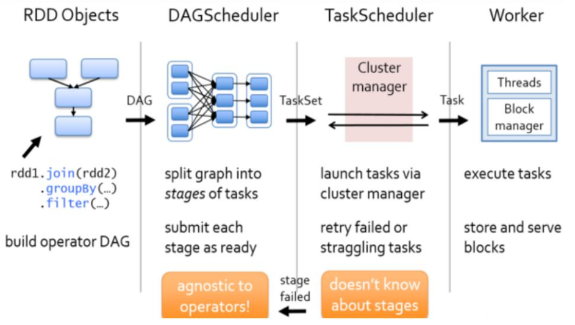
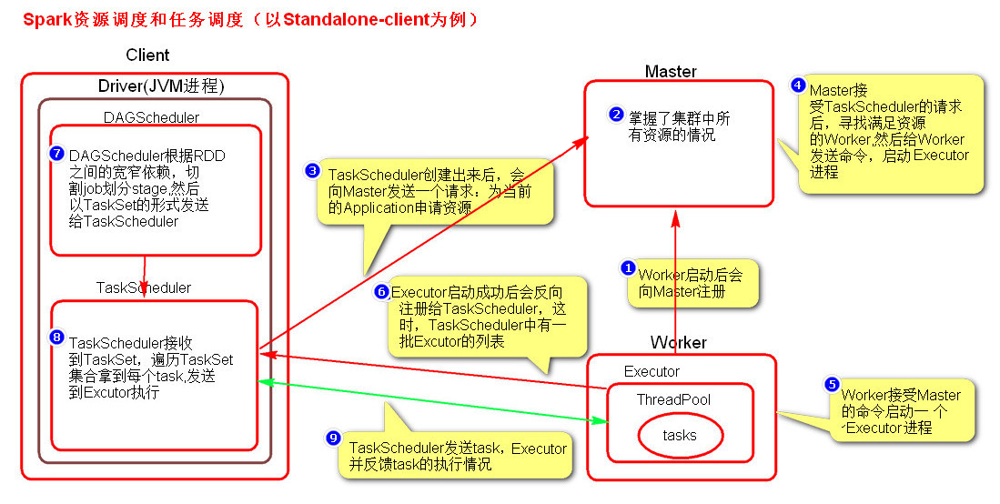

Spark资源调度和任务调度

# 1. Spark资源调度和任务调度的流程
启动集群后，Worker节点会向Master节点汇报资源情况，Master掌握了集群资源情况。

当Spark提交一个Application后，根据RDD之间的依赖关系将Application形成一个DAG有向无环图。

任务提交后，Spark会在Driver端创建两个对象：`DAGScheduler`和`TaskScheduler`

DAGScheduler是任务调度的高层调度器，是一个对象。DAGScheduler的主要作用就是将DAG根据RDD之间的宽窄依赖关系划分为一个个的Stage，然后将这些Stage以TaskSet的形式提交给TaskScheduler（TaskScheduler是任务调度的低层调度器，这里TaskSet其实就是一个集合，里面封装的就是一个个的task任务,也就是stage中的并行度task任务），TaskSchedule会遍历TaskSet集合，拿到每个task后会将task发送到计算节点Executor中去执行（其实就是发送到Executor中的线程池ThreadPool去执行）。
task在Executor线程池中的运行情况会向TaskScheduler反馈，
当task执行失败时，则由TaskScheduler负责重试，将task重新发送给Executor去执行，默认重试3次。如果重试3次依然失败，那么这个task所在的stage就失败了。
stage失败了则由DAGScheduler来负责重试，重新发送TaskSet到TaskScheduler，Stage默认重试4次。
如果重试4次以后依然失败，那么这个job就失败了。
job失败了，Application就失败了。

`TaskScheduler`不仅能重试失败的task,还会重试straggling（落后，缓慢）task（也就是执行速度比其他task慢太多的task）。
如果有运行缓慢的task那么TaskScheduler会启动一个新的task来与这个运行缓慢的task执行相同的处理逻辑。
两个task哪个先执行完，就以哪个task的执行结果为准。这就是Spark的推测执行机制。
在Spark中推测执行默认是关闭的。
推测执行可以通过spark.speculation属性来配置。

**注意：**
- 对于ETL类型要入数据库的业务要关闭推测执行机制，这样就不会有重复的数据入库。
- 如果遇到数据倾斜的情况，开启推测执行则有可能导致一直会有task重新启动处理相同的逻辑，任务可能一直处于处理不完的状态。

# 2. 图解Spark资源调度和任务调度的流程

# 3. 粗粒度资源申请和细粒度资源申请

## 3.1 粗粒度资源申请(Spark）

在Application执行之前，将所有的资源申请完毕，当资源申请成功后，才会进行任务的调度，当所有的task执行完成后，才会释放这部分资源。

优点：在Application执行之前，所有的资源都申请完毕，每一个task直接使用资源就可以了，不需要task在执行前自己去申请资源，task启动就快了，task执行快了，stage执行就快了，job就快了，application执行就快了。
       
缺点：直到最后一个task执行完成才会释放资源，集群的资源无法充分利用。

## 3.2 细粒度资源申请（MapReduce）

Application执行之前不需要先去申请资源，而是直接执行，让job中的每一个task在执行前自己去申请资源，task执行完成就释放资源。

优点：集群的资源可以充分利用。

缺点：task自己去申请资源，task启动变慢，Application的运行就相应的变慢了。
