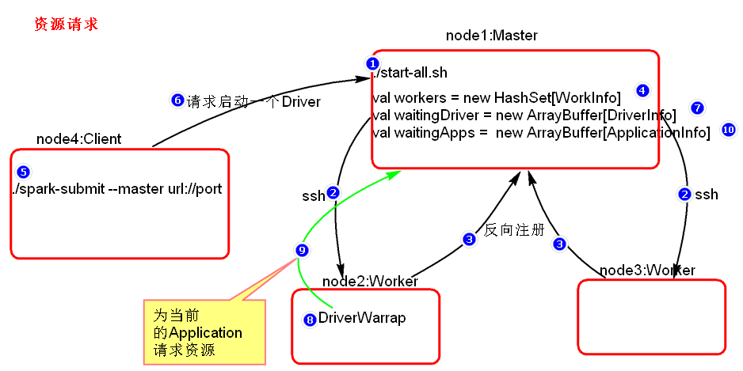
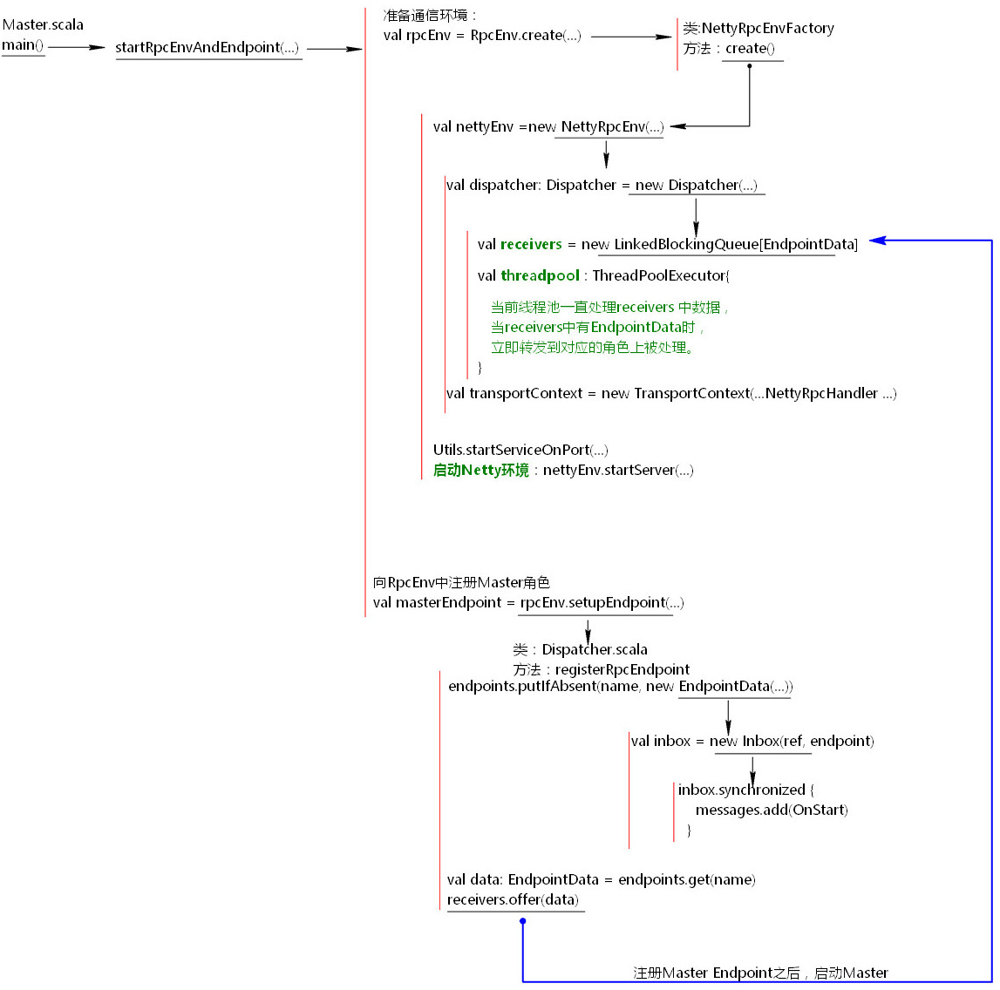
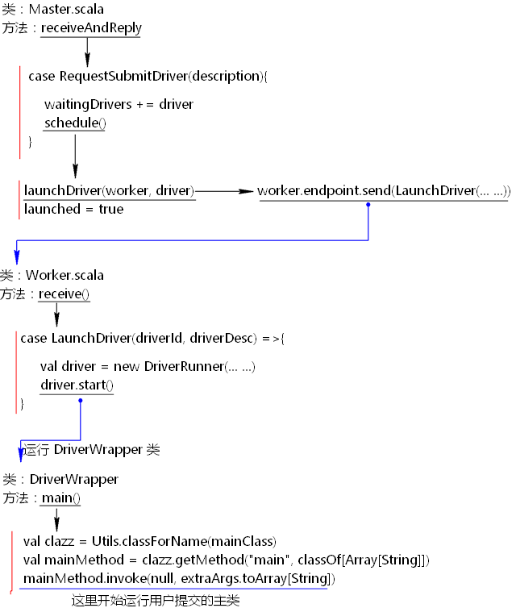
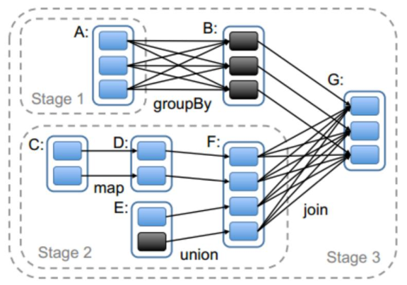

# 1. Spark Master启动
## 1.1 Spark资源任务调度对象关系图



## 1.2 集群启动过程
Spark集群启动之后，首先调用`$SPARK_HOME/sbin/start-all.sh`，start-all.sh脚本中调用了`start-master.sh`脚本和`start-slaves.sh`脚本，

在start-master.sh脚本中可以看到启动Master角色的主类：`org.apache.spark.deploy.master.Master`。

在对应的start-slaves.sh脚本中又调用了start-slave.sh脚本，在star-slave.sh脚本中可以看到启动Worker角色的主类：`org.apache.spark.deploy.worker.Worker`。

### 1.2.1 Master&Worker启动
Spark框架的设计思想是每台节点上都会启动对应的Netty通信环境，叫做`RpcEnv`通信环境。每个角色启动之前首先向`NettyRpcEnv`环境中注册对应的`Endpoint`，然后启动。

角色包括：`Master`，`Worker`,`Driver`,`Executor`等。

下图是启动start-all集群后，Master角色启动过程，Master角色的启动会调用`org.apache.spark.deploy.master.Master`主类，

执行流程如下：




# 2. Spark Submit任务提交

# 2.1 Spark Submit任务提交
Spark submit提交任务时，调用`$SPARK_HOME/bin/spark-submit`
 
spark-submit脚本中调用了`org.apache.spark.deploy.SparkSubmit`类。执行此类时，首先运行main方法进行参数设置，然后向Master申请启动Driver。

代码流程如下图示：


## 2.2 启动DriverWrapper类

当提交任务之后，客户端向Master申请启动Driver，这里首先会启动一个`DriverWrapper`类来对用户提交的application进行包装运行。

DriverWrapper类的启动过程如下：



## 2.3 注册Driver Endpoint，向Master注册Application

当执行用户的代码时，在new SparkContext时，会注册真正的Driver 角色，这个角色名称为`CoarseGrainedScheduler`,Driver角色注册之后，注册`AppClient`角色，由当前这个角色向Master注册Application。

代码流程如下：


# 3. Spark资源调度源码

## 3.1 Spark资源调度源码过程
Spark资源调度源码是在Driver启动之后注册Application完成后开始的。

Spark资源调度主要就是Spark集群如何给当前提交的Spark application在Worker资源节点上划分资源。

Spark资源调度源码在Master.scala类中的schedule()中进行的。

## 3.2 Spark资源调度源码结论

1. Executor在集群中分散启动，有利于task计算的数据本地化。

2. 默认情况下（提交任务的时候没有设置`--executor-cores`选项），每一个Worker为当前的Application启动一个Executor,这个Executor会使用这个Worker的所有的cores和1G内存。

3. 如果想在Worker上启动多个Executor，提交Application的时候要加`--executor-cores`这个选项。

4. 默认情况下没有设置`--total-executor-cores`,一个Application会使用Spark集群中所有的cores。

5. 启动Executor不仅和core有关还和内存有关。

## 3.3 资源调度源码结论验证

使用`spark-submit`提交任务演示。也可以使用`spark-shell`来验证。

1. 默认情况每个worker为当前的Application启动一个Executor，这个Executor使用集群中所有的cores和1G内存。

    ```shell script
    ./spark-submit 
    --master spark://node1:7077
     --class org.apache.spark.examples.SparkPi
     ../lib/spark-examples-1.6.0-hadoop2.6.0.jar 
    10000
    ```
   
2. 在worker上启动多个Executor,设置`--executor-cores`参数指定每个executor使用的core数量。

    ```shell script
    ./spark-submit
     --master  spark://node1:7077
     --executor-cores 1 
     --class org.apache.spark.examples.SparkPi 
    ../lib/spark-examples-1.6.0-hadoop2.6.0.jar 
    10000
    ```
   
3. 内存不足的情况下启动core的情况。Spark启动是不仅看core配置参数，也要看配置的core的内存是否够用。

    ```shell script
    ./spark-submit 
    --master  spark://node1:7077 
    --executor-cores 1  
    --executor-memory 3g 
    --class org.apache.spark.examples.SparkPi
    ../lib/spark-examples-1.6.0-hadoop2.6.0.jar 
    10000
    ```
   
   `--total-executor-cores`集群中共使用多少cores
  
    注意：一个进程不能让集群多个节点共同启动。
   
    ```shell script
    ./spark-submit 
    --master  spark://node1:7077 
    --executor-cores 1  
    --executor-memory 2g 
    --total-executor-cores 3
    --class org.apache.spark.examples.SparkPi
     ../lib/spark-examples-1.6.0-hadoop2.6.0.jar 
    10000
    ```
   
# 4. Spark任务调度源码

Spark任务调度源码是从Spark Application的一个Action算子开始的。

action算子开始执行，会调用RDD的一系列触发job的逻辑。

其中也有stage的划分过程：

