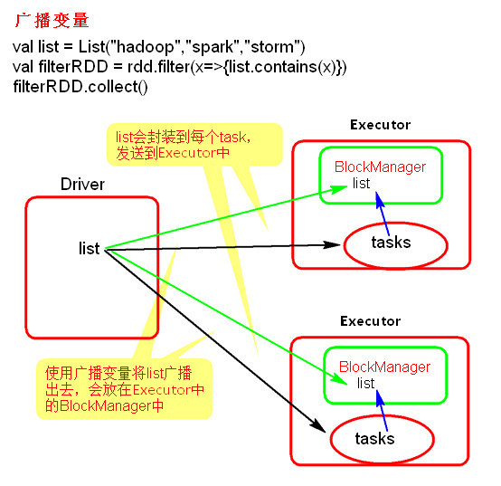
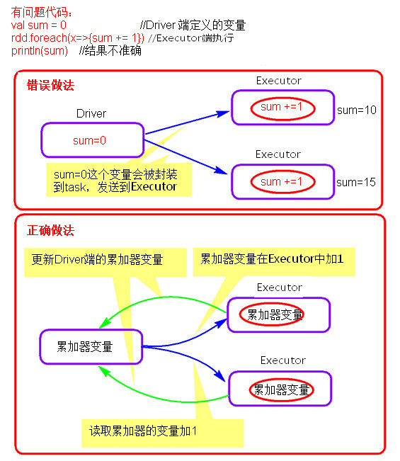
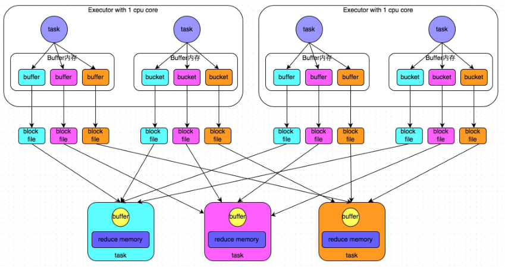
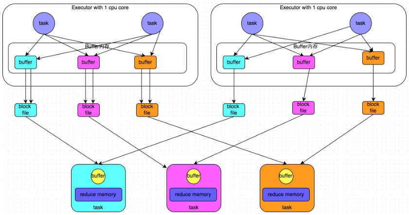
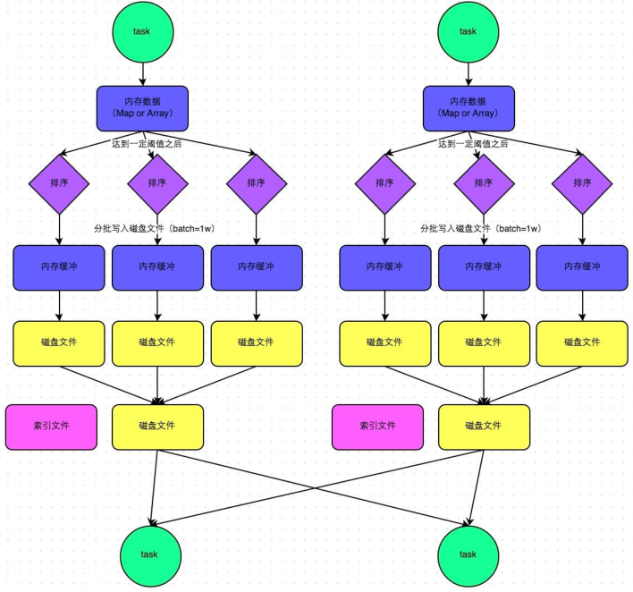
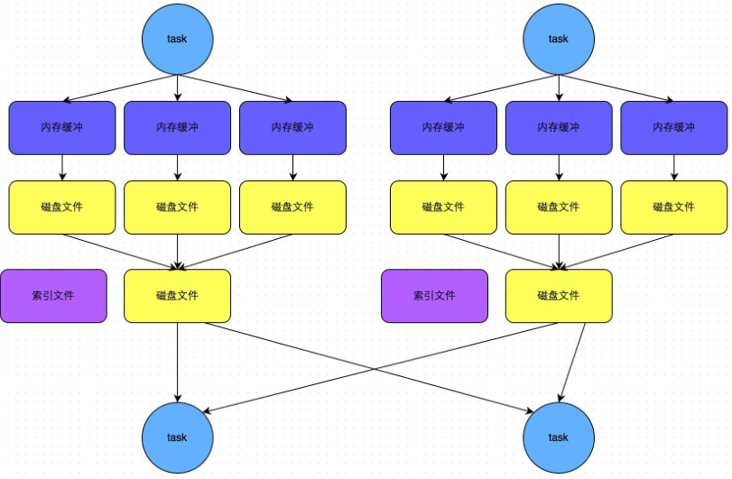
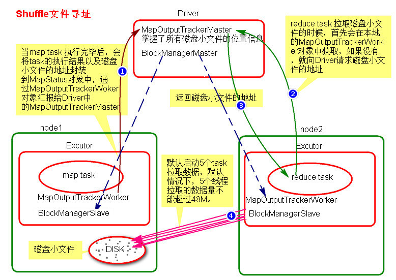
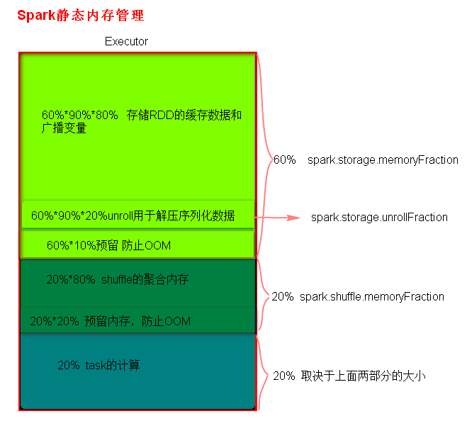
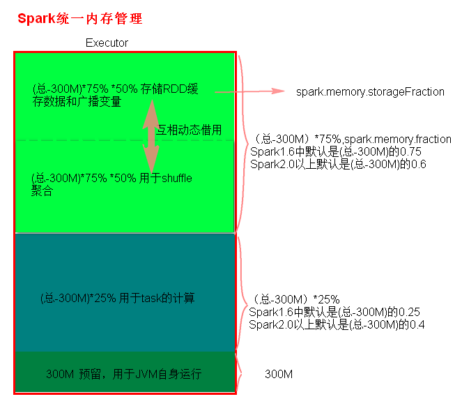

###### Spark Core 高级

[TOC]

# 广播变量

## 广播变量理解图



## 广播变量使用代码
```java
SparkConf conf = new SparkConf();
conf.setMaster("local");
conf.setAppName("BroadcastTest");
JavaSparkContext context = new JavaSparkContext(conf);
// 变量
List<String> list = new ArrayList<>();
list.add("hello spark");
// 将变量广播到Executor端
Broadcast<List<String>> broadcast = context.broadcast(list);
JavaRDD<String> rdd = context.textFile("C:\\code\\IdeaWorkspace\\spark-code\\data\\word.txt");

JavaRDD<String> filterMap = rdd.filter(line -> {
    // 获取广播变量的值
    List<String> value = broadcast.value();
    return value.contains(line);
});

filterMap.foreach(line -> System.out.println(line));
```

```scala
val conf: SparkConf = new SparkConf()
conf.setMaster("local")
conf.setAppName("SecondSortCase")
val context: SparkContext = new SparkContext(conf)
// 变量
val list: List[String] = List[String]("hello spark")
// 将变量广播到Executor端
val bc: Broadcast[List[String]] = context.broadcast(list)
val rdd: RDD[String] = context.textFile("C:\\code\\IdeaWorkspace\\spark-code\\data\\word.txt")
/**
 * 使用广播变量
 */
val filterRDD: RDD[String] = rdd.filter(line => {
  // 获取广播变量的值
  val value: List[String] = bc.value
  value.contains(line)
})
filterRDD.foreach(println)
```
## 注意事项

- 能不能将一个RDD使用广播变量广播出去？
  
    不能，因为RDD是不存储数据的。可以将RDD的结果广播出去。
    
- 广播变量只能在Driver端定义，不能在Executor端定义。

- 在Driver端可以修改广播变量的值，在Executor端无法修改广播变量的值。

# 累加器

## 累加器理解图



## 累加器使用代码
```java
SparkConf conf = new SparkConf();
conf.setMaster("local");
conf.setAppName("SecondSortCase");
JavaSparkContext context = new JavaSparkContext(conf);
JavaRDD<String> rdd = context.textFile("C:\\code\\IdeaWorkspace\\spark-code\\data\\word.txt");
// 获取Scala中的SparkContext
SparkContext sc = context.sc();
// 创建累加器
LongAccumulator iAcc = sc.longAccumulator("acc_i");

JavaRDD<String> mapRDD = rdd.map(line -> {
    // 累加器计数+1
    iAcc.add(1);
    return line;
});
mapRDD.collect();
//acc acc_i value is 66
System.out.println("acc " + iAcc.name().get() + " value is " + iAcc.value());
//66
System.out.println(iAcc.count());   
```

```scala
val conf: SparkConf = new SparkConf()
conf.setMaster("local")
conf.setAppName("SecondSortCase")
val context: SparkContext = new SparkContext(conf)
val rdd: RDD[String] = context.textFile("C:\\code\\IdeaWorkspace\\spark-code\\data\\topn.txt")

// 创建累加器
val iAcc: LongAccumulator = context.longAccumulator("i")
val mapRDD1 = rdd.map(line => {
  // 累加器计数+1
  iAcc.add(1)
  line
})
mapRDD1.count()
// acc i is 24
println(s"acc ${iAcc.name.get} is ${iAcc.count}")
// 24
println(iAcc.value)
```
## 注意事项

累加器在Driver端定义赋初始值，累加器只能在Driver端读取，在Excutor端更新。


## 自定义累加器
top.theonly.spark.jav.core.accumulator.SelfDefinedAccumulatorTest

top.theonly.spark.sca.core.accumulator.SelfDefinedAccumulatorTest.scala

# 二次排序

大数据中很多排序场景是需要先根据一列进行排序，如果当前列数据相同，再对其他某列进行排序的场景，这就是二次排序场景。

例如：要找出网站活跃的前10名用户，活跃用户的评测标准就是用户在当前季度中登录网站的天数最多，如果某些用户在当前季度登录网站的天数相同，那么再比较这些用户的当前登录网站的时长进行排序，找出活跃用户。这就是一个典型的二次排序场景。

解决二次排序问题可以采用封装对象的方式，对象中实现对应的比较方法。

`top.theonly.spark.jav.core.cases.secondsort.SecondSortCase`

`top.theonly.spark.sca.core.cases.secondsort.SecondSortCase`

# 分组取topN

大数据中按照某个Key进行分组，找出每个组内数据的topN时，这种情况就是分组取topN问题。

解决分组取TopN问题有两种方式
- 第一种就是直接分组，对分组内的数据进行排序处理。
- 第二种方式就是直接使用定长数组的方式解决分组取topN问题。

`top.theonly.spark.jav.core.cases.topn.TopNCase`

`top.theonly.spark.sca.core.cases.topn.TopNCase`

# Spark Shuffle

## 概念

reduceByKey会将上一个RDD中的每一个key对应的所有value聚合成一个value，然后生成一个新的RDD，元素类型是<key,value>对的形式，这样每一个key对应一个聚合起来的value。

**问题**：聚合之前，每一个key对应的value不一定都是在一个partition中，也不太可能在同一个节点上，因为RDD是分布式的弹性的数据集，RDD的partition极有可能分布在各个节点上。

**如何聚合**？
- `Shuffle Write`：

    上一个stage的每个map task就必须保证将自己处理的当前分区的数据相同的key写入一个分区文件中，可能会写入多个不同的分区文件中。

- `Shuffle Read`：

    reduce task就会从上一个stage的所有task所在的机器上寻找属于己的那些分区文件，这样就可以保证每一个key所对应的value都会汇聚到同一个节点上去处理和聚合。

Spark中有两种Shuffle管理类型，`HashShufflManager`和`SortShuffleManager`。

Spark1.2之前是HashShuffleManager， Spark1.2引入SortShuffleManager,在Spark 2.0+版本中已经将HashShuffleManager丢弃。

## HashShuffleManager

### 普通机制

**普通机制示意图**



**执行流程**
- 每一个map task将不同结果写到不同的buffer中，每个buffer的大小为32K。buffer起到数据缓存的作用。
- 每个buffer文件最后对应一个磁盘小文件。
- reduce task来拉取对应的磁盘小文件。

**总结：**
1. map task的计算结果会根据分区器（默认是hashPartitioner）来决定写入到哪一个磁盘小文件中去。ReduceTask会去Map端拉取相应的磁盘小文件。
2. 产生的磁盘小文件的个数：
   
    M（map task的个数）*R（reduce task的个数）

**存在的问题**：

产生的磁盘小文件过多，会导致以下问题：

- 在Shuffle Write过程中会产生很多写磁盘小文件的对象。
- 在Shuffle Read过程中会产生很多读取磁盘小文件的对象。
- 在JVM堆内存中对象过多会造成频繁的gc,gc还无法解决运行所需要的内存 的话，就会OOM。
- 在数据传输过程中会有频繁的网络通信，频繁的网络通信出现通信故障的可能性大大增加，一旦网络通信出现了故障会导致shuffle file cannot find 由于这个错误导致的task失败，TaskScheduler不负责重试，由DAGScheduler负责重试Stage。

### 合并机制
**合并机制示意图**



**总结**
    
    产生磁盘小文件的个数：C(core的个数)*R（reduce的个数）

## SortShuffleManager

### 普通机制

**普通机制示意图**



**执行流程**

- map task 的计算结果会写入到一个内存数据结构里面，内存数据结构默认是5M
- 在shuffle的时候会有一个定时器，不定期的去估算这个内存结构的大小，当内存结构中的数据超过5M时，比如现在内存结构中的数据为5.01M，那么他会申请5.01*2-5=5.02M内存给内存数据结构。
- 如果申请成功不会进行溢写，如果申请不成功，这时候会发生溢写磁盘。
- 在溢写之前内存结构中的数据会进行排序分区
- 然后开始溢写磁盘，写磁盘是以batch的形式去写，一个batch是1万条数据，
- map task执行完成后，会将这些磁盘小文件合并成一个大的磁盘文件，同时生成一个索引文件。
- reduce task去map端拉取数据的时候，首先解析索引文件，根据索引文件再去拉取对应的数据。

**总结**
    
    产生磁盘小文件的个数： 2*M（map task的个数）

### bypass机制

**bypass机制示意图**



**总结**

    1. bypass运行机制的触发条件如下：
        shuffle reduce task的数量小于spark.shuffle.sort.bypassMergeThreshold的参数值。这个值默认是200。
    2. 产生的磁盘小文件为：2*M（map task的个数）


# Spark Shuffle 文件寻址

## MapOutputTracker

`MapOutputTracker`是Spark架构中的一个模块，是一个主从架构。管理磁盘小文件的地址。
- `MapOutputTrackerMaster`是主对象，存在于Driver中。
- `MapOutputTrackerWorker`是从对象，存在于Executor中。

## BlockManager

`BlockManager`块管理者，是Spark架构中的一个模块，也是一个主从架构。

- `BlockManagerMaster`,主对象，存在于Driver中。
  
    BlockManagerMaster会在集群中有用到广播变量和缓存数据或者删除缓存数据的时候，通知BlockManagerSlave传输或者删除数据。
    
- `BlockManagerSlave`，从对象，存在于Executor中。

    BlockManagerSlave会与BlockManagerSlave之间通信。

无论在Driver端的BlockManager还是在Executor端的BlockManager都含有三个对象：
1. `DiskStore`:负责磁盘的管理。
2. `MemoryStore`：负责内存的管理。
3. `BlockTransferService`:负责数据的传输。

## Shuffle文件寻址图



## Shuffle文件寻址流程
- 当map task执行完成后，会将task的执行情况和磁盘小文件的地址封装到`MpStatus`对象中，通过`MapOutputTrackerWorker`对象向Driver中的`MapOutputTrackerMaster`汇报。
- 在所有的map task执行完毕后，Driver中就掌握了所有的磁盘小文件的地址。
- 在reduce task执行之前，会通过Executor中`MapOutPutTrackerWorker`向Driver端的`MapOutputTrackerMaster`获取磁盘小文件的地址。
- 获取到磁盘小文件的地址后，会通过`BlockManager`连接数据所在节点，然后通过`BlockTransferService`进行数据的传输。
- `BlockTransferService`默认启动5个task去节点拉取数据。默认情况下，5个task拉取数据量不能超过48M。

# Spark 内存管理
Spark执行应用程序时，Spark集群会启动Driver和Executor两种JVM进程，Driver负责创建SparkContext上下文，提交任务，task的分发等。Executor负责task的计算任务，并将结果返回给Driver。同时需要为需要持久化的RDD提供储存。Driver端的内存管理比较简单，这里所说的Spark内存管理针对Executor端的内存管理。

Spark内存管理分为***静态内存管理***和***统一内存管理***。

Spark1.6之前使用的是静态内存管理，Spark1.6之后引入了统一内存管理。

***静态内存管理***中存储内存、执行内存和其他内存的大小在 Spark 应用程序运行期间均为固定的，但用户可以应用程序启动前进行配置。

***统一内存管理***与***静态内存管理***的区别在于储存内存和执行内存共享同一块空间，可以互相借用对方的空间。

Spark1.6以上版本默认使用的是统一内存管理，可以通过参数`spark.memory.useLegacyMode` 设置为true(默认为false)使用静态内存管理。

- 静态内存管理分布图
  
    
    
- 统一内存管理分布图

    

**reduce 中OOM如何处理？**
1. 减少每次拉取的数据量
2. 提高shuffle聚合的内存比例
3. 提高Executor的总内存


# Shuffle调优

## SparkShuffle调优配置项使用方式

- 在代码中,不推荐使用，硬编码。
    ```java
    new SparkConf().set("spark.shuffle.file.buffer","64")
    ```
- 在提交spark任务的时候，推荐使用。
    ```shell script
    spark-submit --conf spark.shuffle.file.buffer=64 -conf ...
    ```
- 在conf下的`spark-default.conf`配置文件中,不推荐
  
    因为是写死后所有应用程序都要用。

## Spark Shuffle调优参数

- `spark.reducer.maxSizeInFlight`
    - 默认值：48m
    - 参数说明：
      
        该参数用于设置shuffle read task的buffer缓冲大小，而这个buffer缓冲决定了每次能够拉取多少数据。
        
    - 调优建议：
      
        如果作业可用的内存资源较为充足的话，可以适当增加这个参数的大小（比如96m），从而减少拉取数据的次数，也就可以减少网络传输的次数，进而提升性能。在实践中发现，合理调节该参数，性能会有1%~5%的提升。

- `spark.shuffle.io.maxRetries`
    - 默认值：3
    - 参数说明：
    
        shuffle read task从shuffle write task所在节点拉取属于自己的数据时，如果因为网络异常导致拉取失败，是会自动进行重试的。该参数就代表了可以重试的最大次数。如果在指定次数之内拉取还是没有成功，就可能会导致作业执行失败。
    - 调优建议：
    
        对于那些包含了特别耗时的shuffle操作的作业，建议增加重试最大次数（比如60次），以避免由于JVM的full gc或者网络不稳定等因素导致的数据拉取失败。在实践中发现，对于针对超大数据量（数十亿~上百亿）的shuffle过程，调节该参数可以大幅度提升稳定性。
    shuffle file not find    taskScheduler不负责重试task，由DAGScheduler负责重试stage


- `spark.shuffle.io.retryWait`

    - 默认值：5s
    - 参数说明：
      
        具体解释同上，该参数代表了每次重试拉取数据的等待间隔，默认是5s。
    
    - 调优建议：
    
        建议加大间隔时长（比如60s），以增加shuffle操作的稳定性。


- `spark.shuffle.sort.bypassMergeThreshold`

    - 默认值：200
    
    - 参数说明：
    
        当ShuffleManager为SortShuffleManager时，如果shuffle read task的数量小于这个阈值（默认是200），则shuffle write过程中不会进行排序操作，而是直接按照未经优化的HashShuffleManager的方式去写数据，但是最后会将每个task产生的所有临时磁盘文件都合并成一个文件，并会创建单独的索引文件。
    
    - 调优建议：
    
        当你使用SortShuffleManager时，如果的确不需要排序操作，那么建议将这个参数调大一些，大于shuffle read task的数量。那么此时就会自动启用bypass机制，map-side就不会进行排序了，减少了排序的性能开销。但是这种方式下，依然会产生大量的磁盘文件，因此shuffle write性能有待提高。


###### THANKS

