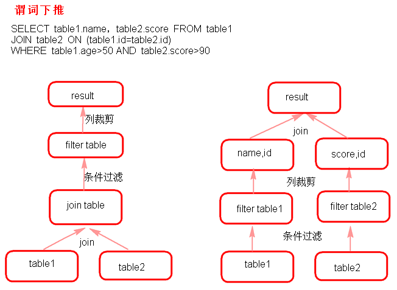
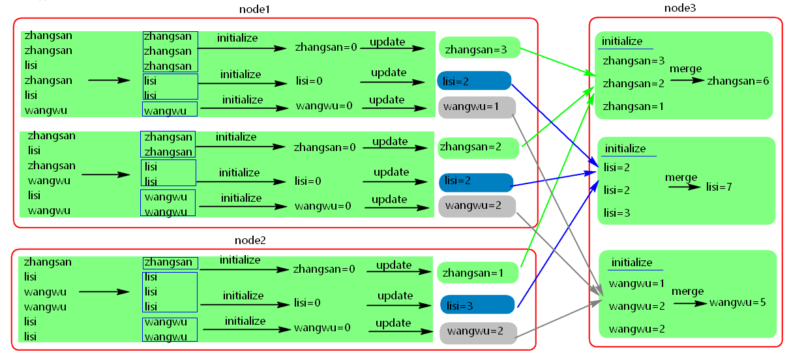

# SparkSQL介绍

# 1. Shark
Shark是基于Spark计算框架之上且兼容Hive语法的SQL执行引擎，由于底层的计算采用了Spark，性能比MapReduce的Hive普遍快2倍以上，当数据全部load在内存的话，将快10倍以上，因此Shark可以作为交互式查询应用服务来使用。除了基于Spark的特性外，Shark是完全兼容Hive的语法，表结构以及UDF函数等，已有的HiveSql可以直接进行迁移至Shark上Shark底层依赖于Hive的解析器，查询优化器，但正是由于SHark的整体设计架构对Hive的依赖性太强，难以支持其长远发展，比如不能和Spark的其他组件进行很好的集成，无法满足Spark的一栈式解决大数据处理的需求。

# 2. SparkSQL

## 2.1 SparkSQL介绍

Hive是Shark的前身，Shark是SparkSQL的前身,SparkSQL产生的根本原因是其完全脱离了Hive的限制。

- SparkSQL支持查询原生的RDD。 RDD是Spark平台的核心概念，是Spark能够高效的处理大数据的各种场景的基础。
- 能够在Scala中写SQL语句。支持简单的SQL语法检查，能够在Scala中写Hive语句访问Hive数据，并将结果取回作为RDD使用。

## 2.2 Spark on Hive和Hive on Spark

Spark on Hive：Hive只作为储存角色，Spark负责sql解析优化，执行。

Hive on Spark：Hive即作为存储又负责sql的解析优化，Spark负责执行。

## 2.3 DataFrame

DataFrame也是一个分布式数据容器。

与RDD类似，然而DataFrame更像传统数据库的二维表格，除了数据以外，还掌握数据的结构信息，即schema。

同时，与Hive类似，DataFrame也支持嵌套数据类型（struct、array和map）。

从API易用性的角度上看， DataFrame API提供的是一套高层的关系操作，比函数式的RDD API要更加友好，门槛更低。

***DataFrame就Row类型的DataSet***

## 2.4 SparkSQL的数据源

SparkSQL的数据源可以是JSON类型的字符串，JDBC,Parquent,Hive，HDFS等。

## 2.5 SparkSQL底层架构

首先拿到sql后解析一批未被解决的逻辑计划，再经过分析得到分析后的逻辑计划，再经过一批优化规则转换成一批最佳优化的逻辑计划，再经过SparkPlanner的策略转化成一批物理计划，随后经过消费模型转换成一个个的Spark任务执行。

## 2.6 谓词下推（predicate Pushdown）



# 3. 创建DataFrame的方式

## 3.1 读取json格式的文件创建DataFrame

注意：
1. 可以两种方式读取json格式的文件。

    scala：
    ```scala
    val frame: DataFrame = session.read.json("./data/sql/json")
    val frame: DataFrame = session.read.format("json").load("./data/json")
    ```
   java：
    ```java
    Dataset<Row> dataset = session.read().json("./data/sql/json");
   Dataset<Row> ds = sqlContext.read().format("json").load("./data/sql/json");
    ```
2. df.show()默认显示前20行数据。
3. DataFrame原生API可以操作DataFrame。
4. 注册成临时表时，表中的列默认按ascii顺序显示列。

    scala：
    ```scala
    df.createTempView("tmp")
    df.createOrReplaceTempView("tmp")
    df.createGlobalTempView("tmp")
    df.createOrReplaceGlobalTempView("tmp")
    ```
    java：   
    ```java
    df.registerTempTable("tmp");
    ```
5. DataFrame是一个一个Row类型的RDD
    ```scala
    df.rdd()
    ```
    ```java
    df.javaRdd();
    ```

## 3.2 通过json格式的RDD创建DataFrame
java：

`top.theonly.spark.jav.sql.textfile.CreateDataFrameByRddTest.createDataFrameByJsonRDD()`

scala：

`top.theonly.spark.sca.sql.textfile.SparkReadCsvTest.CreateDataFrameByRddTest.createDataFrameByJsonRDD()`

## 3.3 非json格式的RDD创建DataFrame

### 3.3.1 反射
通过反射的方式将非json格式的RDD转换成DataFrame（不建议使用）
- 自定义类要可序列化
- 自定义类的访问级别是Public
- RDD转成DataFrame后会根据映射将字段按Assci码排序
- 将DataFrame转换成RDD时获取字段两种方式,一种是df.getInt(0)下标获取（不推荐使用），另一种是df.getAs(“列名”)获取（推荐使用）

java：

`top.theonly.spark.jav.sql.textfile.CreateDataFrameByRddTest.createDataFrameByRDDUseReflect()`

scala：

`top.theonly.spark.sca.sql.textfile.SparkReadCsvTest.CreateDataFrameByRddTest.createDataFrameByRDDUseReflect()`

### 3.3.2 动态创建Schema将非json格式的RDD转换成DataFrame

java：

`top.theonly.spark.jav.sql.textfile.CreateDataFrameByRddTest.createDataFrameByRDDByDynamicSchema()`

scala：

`top.theonly.spark.sca.sql.textfile.SparkReadCsvTest.CreateDataFrameByRddTest.createDataFrameByRDDByDynamicSchema()`

## 3.4 读取parquet文件创建DataFrame

可以将DataFrame存储成parquet文件。

保存成parquet文件的方式有两种：
```scala
df.write().mode(SaveMode.Overwrite)format("parquet").save("./sparksql/parquet");
df.write().mode(SaveMode.Overwrite).parquet("./sparksql/parquet");
```

java：

`top.theonly.spark.jav.sql.parquet.SparkParquetFileTest`

scala：

`top.theonly.spark.sca.sql.parquet.SparkParquetFileTest`

## 3.5 读取JDBC中的数据创建DataFrame(MySql为例)

java：

`top.theonly.spark.jav.sql.jdbc.SparkOnJdbcTest`

scala：

`top.theonly.spark.sca.sql.jdbc.SparkOnJdbcTest`

## 3.6 读取csv文件创建DataFrame

java：

`top.theonly.spark.jav.sql.textfile.SparkReadCsvTest`

scala：

`top.theonly.spark.sca.sql.textfile.SparkReadCsvTest`

# 4. Spark on Hive

# 4.1 配置
1. 在Spark客户端配置Hive On Spark

    在Spark客户端安装包下spark-2.3.1/conf中创建文件hive-site.xml：

    配置hive的metastore路径
    ```xml
    <configuration>
       <property>
            <name>hive.metastore.uris</name>
            <value>thrift://node2:9083</value>
       </property>
    </configuration>
    ```
   
2. 启动zookeeper集群，启动HDFS集群。

3. 启动Hive的metastore服务

    ```shell script
    hive --service metastore  
    ```

4. 启动SparkShell 读取Hive中的表总数，对比hive中查询同一表查询总数测试时间。
    ```shell script
    ./spark-shell 
    --master spark://node1:7077,node2:7077 
     --executor-cores 1 
    --executor-memory 1g 
    --total-executor-cores 1
    ```
   
    ```scala
    import org.apache.spark.sql.hive.HiveContext
    val hc = new HiveContext(sc)
    hc.sql("show databases").show
    hc.sql("user default").show
    hc.sql("select count(*) from jizhan").show
    ```
**注意**：
    
    如果使用Spark on Hive  查询数据时，出现错误：
    Caused by: java.net.UnknownHostException: ...
    找不到HDFS集群路径，要在客户端机器conf/spark-env.sh中设置HDFS的路径：
    export HADOOP_CONF_DIR=$HADOOP_HOME/etc/hadoop
    
## 4.2 读取Hive中的数据加载成DataFrame
在Spark1.6版本中HiveContext是SQLContext的子类，连接Hive使用HiveContext。

在Spark2.0+版本中之后，建议使用SparkSession对象，读取Hive中的数据需要开启Hive支持。

由于本地没有Hive环境，要提交到集群运行，提交命令：

```shell script
./spark-submit 
--master spark://node1:7077,node2:7077 
--executor-cores 1 
--executor-memory 2G 
--total-executor-cores 1
--class top.theonly.spark.jav.sql.hive.SparkOnHiveTest
/root/test/spark-code.jar
```

# 5. DataFrame存储
1. 将DataFrame存储为parquet文件。
    ```scala
    df.write.mode(SaveMode.Overwrite).parquet(parquetFilePath)
    //df.write.mode(SaveMode.ErrorIfExists).format("parquet").save(parquetFilePath)
    ```
2. 将DataFrame存储到JDBC数据库。
    ```scala
    df.write.mode(SaveMode.Overwrite).jdbc(url, table, properties)
    ```
3. 将DataFrame存储到Hive表。
    ```scala
    df.write.mode(SaveMode.Overwrite).saveAsTable(tableName);
    ```
   
# 6. Spark UDF和UDAF函数

# 6.1 UDF 用户自定义函数

可以自定义类实现UDFX接口

java：

`top.theonly.spark.jav.sql.udf.SparkUDFTest`

scala：

`top.theonly.spark.sca.sql.udf.SparkUDFTest`

# 6.2 UDAF:用户自定义聚合函数

实现UDAF函数如果要自定义类要继承`UserDefinedAggregateFunction`类.



java：

`top.theonly.spark.jav.sql.udf.SparkUDAFTest`

scala：

`top.theonly.spark.sca.sql.udf.SparkUDAFTest`


# 7. 开窗函数 over()

开窗函数格式：

`row_number() over (partitin by 字段1 order by 字段2)`

如果SQL语句里面使用到了开窗函数，那么这个SQL语句必须使用HiveContext来执行，HiveContext默认情况下在本地无法创建。在MySql8之后也增加了开窗函数。

java：

`top.theonly.spark.jav.sql.over.SparkOverFuncTest`

scala：

`top.theonly.spark.sca.sql.over.SparkOverFuncTest`
