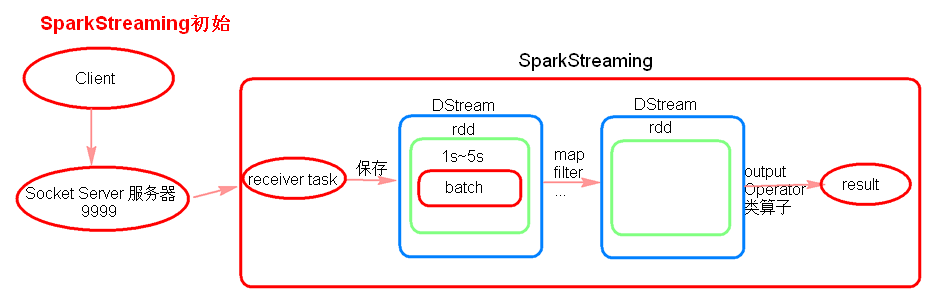
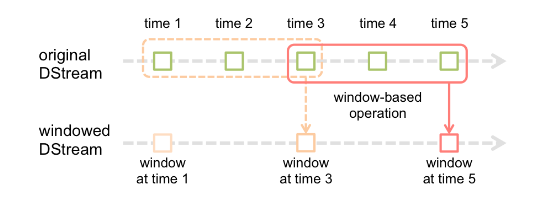
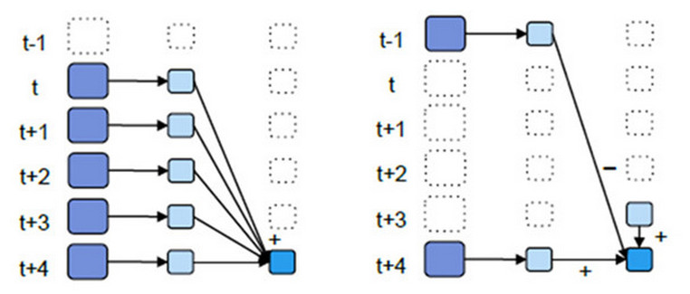

###### SparkStreaming

[TOC]

# SparkStreaming简介

SparkStreaming是流式处理框架，是Spark API的扩展，支持可扩展、高吞吐量、容错的实时数据流处理，实时数据的来源可以是：Kafka, Flume, Twitter, ZeroMQ或者TCP sockets，并且可以使用高级功能的复杂算子来处理流数据。例如：map,reduce,join,window 。最终，处理后的数据可以存放在文件系统，数据库等，方便实时展现。

# SparkStreaming与Storm的区别
1. Storm是纯实时的流式处理框架，SparkStreaming是准实时的处理框架（微批处理）。因为微批处理，SparkStreaming的吞吐量比Storm要高。
2. Storm 的事务机制要比SparkStreaming的要完善。
3. Storm支持动态资源调度。(spark1.2开始和之后也支持)
4. SparkStreaming擅长复杂的业务处理，Storm不擅长复杂的业务处理，擅长简单的汇总型计算。

# SparkStreaming理解

receiver task是7*24小时一直在执行，一直接收数据，将一段时间内接收来的数据保存到batch中。假设batchInterval为5s,那么会将接收来的数据每隔5秒封装到一个batch中，batch没有分布式计算特性，这一个batch的数据又被封装到一个RDD中，RDD最终封装到一个DStream中。

例如：假设batchInterval为5秒，每隔5秒通过SparkStreaming将得到一个DStream,在第6秒的时候计算这5秒的数据，假设执行任务的时间是3秒,那么第6~9秒一边在接收数据，一边在计算任务，9~10秒只是在接收数据。然后在第11秒的时候重复上面的操作。

- 如果job执行的时间大于batchInterval会有什么样的问题？

    如果接受过来的数据设置的级别是仅内存，接收来的数据会越堆积越多，最后可能会导致OOM（如果设置StorageLevel包含disk, 则内存存放不下的数据会溢写至disk, 加大延迟 ）。
# SparkStreaming代码

以SparkStreaming接收Socket数据为例：
java：

`top.theonly.spark.jav.streaming.SparkStreamingReadSocket`

scala：

`top.theonly.spark.sca.streaming.SparkStreamingReadSocket`

**注意：**

1. 启动socket server 服务器：nc –lk 9999
2. receiver模式下接受数据，local的模拟线程必须大于等于2，一个线程用来receiver用来接受数据，另一个线程用来执行job。
3. Durations时间设置就是我们能接收的延迟度。这个需要根据集群的资源情况以及任务的执行情况来调节。
4. 创建JavaStreamingContext有两种方式（SparkConf,SparkContext）
5. 所有的代码逻辑完成后要有一个output operation类算子。
6. JavaStreamingContext.start() Streaming框架启动后不能再次添加业务逻辑。
7. JavaStreamingContext.stop() 无参的stop方法将SparkContext一同关闭，stop(false)，不会关闭SparkContext。
8. JavaStreamingContext.stop()停止之后不能再调用start。

# SparkStreaming算子

`top.theonly.spark.jav.streaming.operator`

`top.theonly.spark.sca.streaming.operator`

- `foreachRDD`

    output operation算子,必须对抽取出来的RDD执行action类算子，代码才能执行。
    
- `transform`

    transformation类算子
    
    可以通过transform算子，对Dstream做RDD到RDD的任意操作。
    
- `updateStateByKey`

    transformation算子

    updateStateByKey作用：
    1. 为SparkStreaming中每一个Key维护一份state状态，state类型可以是任意类型的，可以是一个自定义的对象，更新函数也可以是自定义的。
    2. 通过更新函数对该key的状态不断更新，对于每个新的batch而言，SparkStreaming会在使用updateStateByKey的时候为已经存在的key进行state的状态更新。

    **使用到updateStateByKey要开启checkpoint机制和功能。**
    
    多久会将内存中的数据写入到磁盘一份？
    
        如果batchInterval设置的时间小于10秒，那么10秒写入磁盘一份。如果batchInterval设置的时间大于10秒，那么就会batchInterval时间间隔写入磁盘一份。

- Window(窗口操作)
    - 窗口操作理解图
    
        假设每隔5s 1个batch,上图中窗口长度为15s，窗口滑动间隔10s。
        
        
        
    - 窗口长度和滑动间隔必须是batchInterval的整数倍。如果不是整数倍会检测报错。
    
    - 优化后的window窗口操作示意图
        
        
    - 优化后的window操作要保存状态，所以要设置checkpoint路径，没有优化的window操作可以不设置checkpoint路径。
# Driver HA

`top.theonly.spark.jav.streaming.SparkStreamingDriverHA`

`top.theonly.spark.sca.streaming.SparkStreamingDriverHA`

