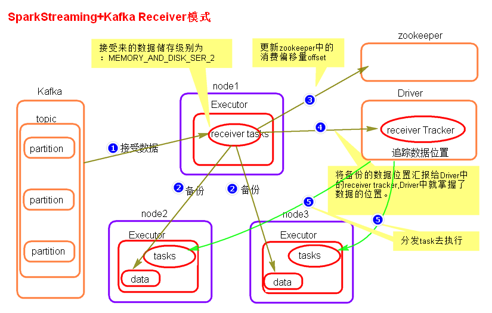
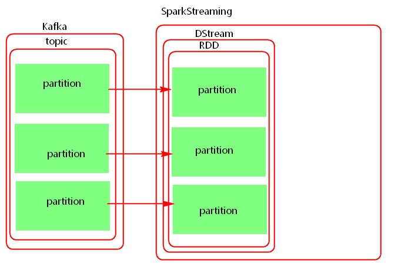

# 1. SparkStreaming1.6 + Kafka0.8.2


SparkStreaming1.6版本+Kafka0.8.2 版本整合方式有两种模式，一种是Receiver模式，另一种是Direct模式。


http://spark.apache.org/docs/1.6.0/streaming-programming-guide.html

http://spark.apache.org/docs/1.6.0/streaming-kafka-integration.html

## 1.1 Receiver模式

### 1.1.1 Receiver模式原理图



### 1.1.2 Receiver模式理解

Receiver模式中，SparkStreaming使用Receiver接收器模式来接收kafka中的数据，即会将每批次数据都存储在Spark端，默认的存储级别为`MEMORY_AND_DISK_SER_2`，从Kafka接收过来数据之后，还会将数据备份到其他Executor节点上，当完成备份之后，再将消费者offset数据写往zookeeper中，然后再向Driver汇报数据位置，Driver发送task到数据所在节点处理数据。

这种模式使用zookeeper来保存消费者offset，等到SparkStreaming重启后，从zookeeper中获取offset继续消费。

当Driver挂掉时，同时消费数据的offset已经更新到zookeeper中时，SparkStreaming重启后，接着zookeeper存储的offset继续处理数据，这样就存在丢失数据的问题。
为了解决以上丢失数据的问题，可以开启WAL(write ahead log)预写日志机制，将从kafka中接收来的数据备份完成之后，向指定的checkpoint中也保存一份，这样当SparkStreaming挂掉，重新启动再处理数据时，会处理Checkpoint中最近批次的数据，将消费者offset继续更新保存到zookeeper中。
开启WAL机制，需要设置checkpoint,由于一般checkpoint路径都会设置到HDFS中，HDFS本身会有副本，所以这里如果开启WAL机制之后，可以将接收数据的存储级别降级，去掉"_2"级别。


开启WAL机制之后带来了新的问题：

1. 数据重复处理问题

    由于开启WAL机制，会处理checkpoint中最近一段时间批次数据，这样会造成重复处理数据问题。所以对于数据需要精准消费的场景，不能使用receiver模式。如果不开启WAL机制Receiver模式有丢失数据的问题，开启WAL机制之后有重复处理数据的问题，对于精准消费数据的场景，只能人为保存offset来保证数据消费的准确性。
    
2. 数据处理延迟加大问题

    数据在节点之间备份完成后再向checkpoint中备份，之后再向Zookeeper汇报数据offset，向Driver汇报数据位置，然后Driver发送task处理数据。这样加大了数据处理过程中的延迟。
    
    
对于精准消费数据的问题，需要我们从每批次中获取offset然后保存到外部的数据库来实现来实现仅一次消费数据。但是Receiver模式底层读取Kafka数据的实现使用的是High Level Consumer Api，这种Api不支持获取每批次消费数据的offset。所以对于精准消费数据的场景不能使用这种模式。

### 1.1.3 Receiver模式总结
1. Receiver模式采用了Receiver接收器的模式接收数据。会将每批次的数据存储在Executor内存或者磁盘中。
2. Receiver模式有丢失数据问题，开启WAL机制解决，但是带来新的问题。
3. receiver模式依赖zookeeper管理消费者offset。
4. SparkStreaming读取Kafka数据，相当于Kafka的消费者，底层读取Kafka采用了`High Level Consumer API`实现，这种api没有提供操作每批次数据offset的接口，所以对于精准消费数据的场景想要人为控制offset是不可能的。

### 1.1.4 Receiver模式代码实现

```java
SparkConf conf = new SparkConf().setAppName("SparkStreamingOnKafkaReceiver").setMaster("local[2]");
//开启预写日志 WAL机制
conf.set("spark.streaming.receiver.writeAheadLog.enable","true");

JavaStreamingContext jsc = new JavaStreamingContext(conf,Durations.seconds(5));
jsc.checkpoint("./receivedata");

Map<String, Integer> topicConsumerConcurrency = new HashMap<String, Integer>();
/**
 * 设置读取的topic和接受数据的线程数
 */
topicConsumerConcurrency.put("topic1101",1);

/**
 * 第一个参数是StreamingContext
 * 第二个参数是ZooKeeper集群信息（接受Kafka数据的时候会从Zookeeper中获得Offset等元数据信息）
 * 第三个参数是Consumer Group 消费者组
 * 第四个参数是消费的Topic以及并发读取Topic中Partition的线程数
 * 
 * 注意：
 * KafkaUtils.createStream 使用五个参数的方法，设置receiver的存储级别
 */
JavaPairReceiverInputDStream<String,String> lines = KafkaUtils.createStream(
     jsc,
     "mynode3:2181,mynode4:2181,mynode5:2181",
     "MyFirstConsumerGroup", 
     topicConsumerConcurrency/*,StorageLevel.MEMORY_AND_DISK()*/
);

JavaDStream<String> words = lines.flatMap(new   FlatMapFunction<Tuple2<String,String>, String>(){ 
  public Iterable<String> call(Tuple2<String,String> tuple) throws Exception {
    System.out.println("key = "+tuple._1);
    System.out.println("value = "+tuple._2);
    return Arrays.asList(tuple._2.split("\t"));
  }
});


JavaPairDStream<String, Integer> pairs = 
words.mapToPair(new PairFunction<String, String, Integer>() {
  public Tuple2<String, Integer> call(String word) throws Exception {
    return new Tuple2<String, Integer>(word, 1);
  }
});


JavaPairDStream<String, Integer> wordsCount = 
pairs.reduceByKey(new Function2<Integer, Integer, Integer>() { 
  public Integer call(Integer v1, Integer v2) throws Exception {
    return v1 + v2;
  }
});


wordsCount.print(100);


jsc.start();
jsc.awaitTermination();
jsc.close();
```

### 1.1.5 Receiver的并行度设置
receiver的并行度是由`spark.streaming.blockInterval`来决定的，默认为200ms,假设`batchInterval`为5s,那么每隔`blockInterval`就会产生一个block,这里就对应每批次产生RDD的partition,这样5秒产生的这个DStream中的这个RDD的partition为25个，并行度就是25。如果想提高并行度可以减少`blockInterval`的数值，但是最好不要低于50ms。

## 1.2 Direct模式

### 1.2.1 Direct模式原理图



### 1.2.2 Direct模式理解
Direct模式就是将kafka看成存数据的一方，这种模式没有采用Receiver接收器模式，而是采用直连的方式，不是被动接收数据，而是主动去取数据，在处理每批次时会根据offset位置向Kafka中获取数据。

消费者偏移量也不是用zookeeper来管理，而是使用Spark自己进行消费者偏移量的维护，如果没有设置checkpoint机制，消费偏移量默认是存在内存中，如果设置了checkpoint目录，那么消费偏移量也会保存在checkpoint中。当SparkStreaming停止后，我们可以使用`val  ssc = StreamFactory.getOrCreate(checkpointDir,Fun)`来恢复停止之前SparkStreaming处理数据的进度，当然，这种方式存在重复消费数据和逻辑改变之后不可执行的问题。

Direct模式底层读取Kafka数据实现是`Simple Consumer api`实现，这种api提供了从每批次数据中获取`offset`的接口，所以对于精准消费数据的场景，可以使用Direct 模式手动维护offset方式来实现数据精准消费。

### 1.2.3 Direct模式并行度设置

Direct模式的并行度与当前读取的topic的partition个数一致，所以Direct模式并行度由读取的kafka中topic的partition数决定的。

### 1.2.4 Direct模式代码实现

```java
SparkConf conf = new SparkConf().setMaster("local").setAppName("SparkStreamingOnKafkaDirected");
JavaStreamingContext jsc = new JavaStreamingContext(conf, Durations.seconds(5));
/**
 * 可以不设置checkpoint 不设置不保存offset,offset默认在内存中有一份，如果设置checkpoint在checkpoint也有一份offset， 一般要设置。
 */
jsc.checkpoint("./checkpoint");
Map<String, String> kafkaParameters = new HashMap<String, String>();
kafkaParameters.put("metadata.broker.list", "mynode1:9092,mynode2:9092,mynode3:9092");
HashSet<String> topics = new HashSet<String>();
topics.add("topic1101");

JavaPairInputDStream<String,String> lines =    KafkaUtils.createDirectStream(jsc,
    String.class, 
    String.class,
    StringDecoder.class,
    StringDecoder.class,
    kafkaParameters,
  topics);

JavaDStream<String> words = lines.flatMap(new    FlatMapFunction<Tuple2<String,String>, String>() {
  public Iterable<String> call(Tuple2<String,String> tuple) throws Exception {
    System.out.println("key = "+tuple._1);
    return Arrays.asList(tuple._2.split("\t"));
  }
});

JavaPairDStream<String, Integer> pairs = words.mapToPair(new   PairFunction<String, String, Integer>() {
  public Tuple2<String, Integer> call(String word) throws Exception   {
    return new Tuple2<String, Integer>(word, 1);
  }
});


JavaPairDStream<String, Integer> wordsCount = pairs.reduceByKey(new Function2<Integer, Integer, Integer>() {
  public Integer call(Integer v1, Integer v2) throws Exception {
    return v1 + v2;
  }
});

wordsCount.print();
jsc.start();
jsc.awaitTermination();
jsc.close();
```

# 2. SparkStreaming2.3 + kafka0.10.0 or higher  Direct模式

http://spark.apache.org/docs/2.3.1/streaming-programming-guide.html

http://spark.apache.org/docs/2.3.1/streaming-kafka-0-10-integration.html

## 2.1 SparkStreaming2.3+kafka 改变

1. 丢弃了SparkStreaming+kafka 的receiver模式。
2. 采用了新的消费者api实现，类似于1.6中SparkStreaming 读取 kafka Direct模式。并行度一样。
3. 因为采用了新的消费者api实现，所以相对于1.6的Direct模式【simple api实现】 ，api使用上有很大差别。未来这种api有可能继续变化。
4. kafka中有两个参数：
    
    `heartbeat.interval.ms`：这个值代表 kafka集群与消费者之间的心跳间隔时间，kafka 集群确保消费者保持连接的心跳通信时间间隔。这个时间默认是3s.这个值必须设置的比`session.timeout.ms` appropriately 小，一般设置不大于 `session.timeout.ms`的1/3。
    `session.timeout.ms`：这个值代表消费者与kafka之间的session 会话超时时间，如果在这个时间内，kafka 没有接收到消费者的心跳`heartbeat.interval.ms` 控制，那么kafka将移除当前的消费者。这个时间默认是10s。这个时间是位于 `group.min.session.timeout.ms`【6s】 和 `group.max.session.timeout.ms`【300s】之间的一个参数,如果SparkSteaming 批次间隔时间大于5分钟，也就是大于300s,那么就要相应的调大`group.max.session.timeout.ms` 这个值。

5. 大多数情况下，SparkStreaming读取数据使用 `LocationStrategies.PreferConsistent` 这种策略，这种策略会将分区均匀的分布在集群的Executor之间。
    
    如果Executor在kafka 集群中的某些节点上，可以使用 `LocationStrategies.PreferBrokers` 这种策略，那么当前这个Executor 中的数据会来自当前broker节点。

    如果节点之间的分区有明显的分布不均，可以使用 `LocationStrategies.PreferFixed` 这种策略,可以通过一个map 指定将topic分区分布在哪些节点中。
    
6. 新的消费者api 可以将kafka 中的消息预读取到缓存区中，默认大小为64k。默认缓存区在 Executor 中，加快处理数据速度。可以通过参数 `spark.streaming.kafka.consumer.cache.maxCapacity` 来增大，也可以通过`spark.streaming.kafka.consumer.cache.enabled` 设置成false 关闭缓存机制。

7. 关于消费者offset
   
   - 如果设置了checkpoint ,那么offset 将会存储在checkpoint中。这种有缺点: 第一，当从checkpoint中恢复数据时，有可能造成重复的消费，需要我们写代码来保证数据的输出幂等。第二，当代码逻辑改变时，无法从checkpoint中来恢复offset.
   - 依靠kafka 来存储消费者offset,kafka 中有一个特殊的topic 来存储消费者offset。
   
        新的消费者api中，会定期自动提交offset。这种情况有可能也不是我们想要的，因为有可能消费者自动提交了offset,但是后期SparkStreaming 没有将接收来的数据及时处理保存。
        
        这里也就是为什么会在配置中将`enable.auto.commit` 设置成false的原因。
        
        这种消费模式也称最多消费一次，默认sparkStreaming 拉取到数据之后就可以更新offset,无论是否消费成功。自动提交offset的频率由参数`auto.commit.interval.ms` 决定，默认5s。
        
        如果我们能保证完全处理完业务之后，可以后期异步的手动提交消费者offset。但是这种将offset存储在kafka中由参数`offsets.retention.minutes=1440`控制是否过期删除，默认是保存一天，如果停机没有消费达到时长，存储在kafka中的消费者组会被清空，offset也就被清除了。
        
   - 自己存储offset,这样在处理逻辑时，保证数据处理的事务，如果处理数据失败，就不保存offset，处理数据成功则保存offset.这样可以做到精准的处理一次处理数据。
   
## 2.2 代码实现
```scala
val conf = new SparkConf()
conf.setMaster("local")
conf.setAppName("SparkStreamingOnKafkaDirect")
val ssc = new StreamingContext(conf,Durations.seconds(5))
//设置日志级别
//ssc.sparkContext.setLogLevel("ERROR")
val kafkaParams = Map[String, Object](
    "bootstrap.servers" -> "mynode1:9092,mynode2:9092,mynode3:9092",
    "key.deserializer" -> classOf[StringDeserializer],
    "value.deserializer" -> classOf[StringDeserializer],
    "group.id" -> "MyGroupId",//
    /**
     *
     * earliest ：当各分区下有已提交的offset时，从提交的offset开始消费；无    提交的offset时，从头开始
     * latest：自动重置偏移量为最大偏移量【默认】*
     * none:没有找到以前的offset,抛出异常
     */
    "auto.offset.reset" -> "earliest",
    /**
     * 当设置 enable.auto.commit为false时，不会自动向kafka中保存消费者  offset.需要异步的处理完数据之后手动提交
     */
    "enable.auto.commit" -> (false: java.lang.Boolean)//默认是true
)

val topics = Array[String]("topic1104")
val stream: InputDStream[ConsumerRecord[String, String]] = KafkaUtils.createDirectStream[String, String](
  ssc,
  PreferConsistent,//消费策略
  Subscribe[String, String](topics, kafkaParams)
)

val transStrem: DStream[String] = stream.map((record:ConsumerRecord[String, String]) => {
  val key_value = (record.key, record.value)
  println("receive message key = "+key_value._1)
  println("receive message value = "+key_value._2)
  key_value._2
})
val wordsDS: DStream[String] = transStrem.flatMap(line=>{line.split("\t")})
  val result: DStream[(String, Int)] = wordsDS.map((_,1)).reduceByKey(_+_)
  result.print()

/**
 * 以上业务处理完成之后，异步的提交消费者offset,这里将 enable.auto.commit  设置成false,就是使用kafka 自己来管理消费者offset
 * 注意这里，获取 offsetRanges: Array[OffsetRange] 每一批次topic 中的 offset时，必须从 源头读取过来的 stream中获取，不能从经过stream转换之后的DStream中获取。
 */
stream.foreachRDD { rdd =>
  val offsetRanges: Array[OffsetRange] =   rdd.asInstanceOf[HasOffsetRanges].offsetRanges
  // some time later, after outputs have completed
  for(or <- offsetRanges){
    println(s"current topic = ${or.topic},partition =  ${or.partition},fromoffset = ${or.fromOffset},untiloffset=${or.untilOffset}")
    }
    stream.asInstanceOf[CanCommitOffsets].commitAsync(offsetRanges)
  }
ssc.start()
ssc.awaitTermination()
ssc.stop()
```

## 2.3 手动维护消费者offset

`top.theonly.spark.jav.streaming.kafka.ManageOffsetUseRedis`

## 2.4 参数配置

### 2.4.1 Kafka参数配置：

http://kafka.apache.org/0100/documentation.html

- `bootstrap.servers`  指定Kafka 集群 
- `key.deserializer`  指定key的序列化格式 
- `value.deserializer` 指定value的序列化格式 
- `group.id` 指定消费者组 
- `auto.offset.reset` 消费者连接Kafka 消费数据的位置 
- `enable.auto.commit`   自动向Kafka提交offset 
- `heartbeat.interval.ms`  kafka集群与consumer 的心跳【3s】 
- `session.timeout.ms`  session 会话超时时间【30s】 
- `group.min.session.timeout.ms`【6s】 
- `group.max.session.timeout.ms`【300s】 
- `auto.commit.interval.ms`   自动提交offset间隔时间 

### 2.4.2 SparkStreaming参数配置：

http://spark.apache.org/docs/2.3.1/configuration.html

- `spark.streaming.blockInterval` 

    SparkStreaming接收器接收的数据在存储到Spark之前被分块成数据块的间隔；建议值大于50ms；默认200ms 
- `spark.streaming.receiver.maxRate`  
 
    每个接收器接收数据的最大速率（每秒记录数）。实际上，每个流最多每秒消耗这个记录数。将此配置设置为0或负数将不会对速率施加限制。
    
- `spark.streaming.receiver.writeAheadLog.enable`

    为接收器启用写前日志。通过接收器接收到的所有输入数据将保存为写入提前日志，从而允许在驱动程序故障后恢复。默认值：false
    
- `spark.streaming.stopGracefullyOnShutdown` 

    如果为true，则Spark会在JVM关闭时优雅地关闭StreamingContext，而不是立即关闭。默认值：false
    
- `spark.streaming.kafka.maxRatePerPartition` 

    使用新的Kafka direct stream API时从每个Kafka分区读取数据的最大速率（每秒记录数）
    
- `spark.streaming.backpressure.enabled` 
    
    启用或禁用Spark Streaming的内部背压机制（自1.5版起）。这使得Spark Streaming能够基于当前批调度延迟和处理时间来控制接收速率，以便系统接收的速度与系统处理的速度一样快。在内部，它动态地设置接收器的最大接收速率。如果设置了spark.streaming.receiver.maxRate和spark.streaming.kafka.maxRatePerPartition，则该速率的上限为它们。
    默认值false
    
- `spark.streaming.backpressure.initialRate` 

    启用背压机制时每个接收器接收第一批数据的初始最大接收速率。
