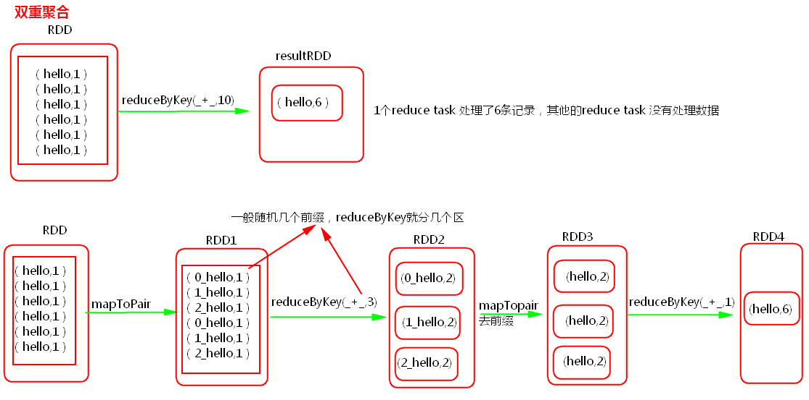
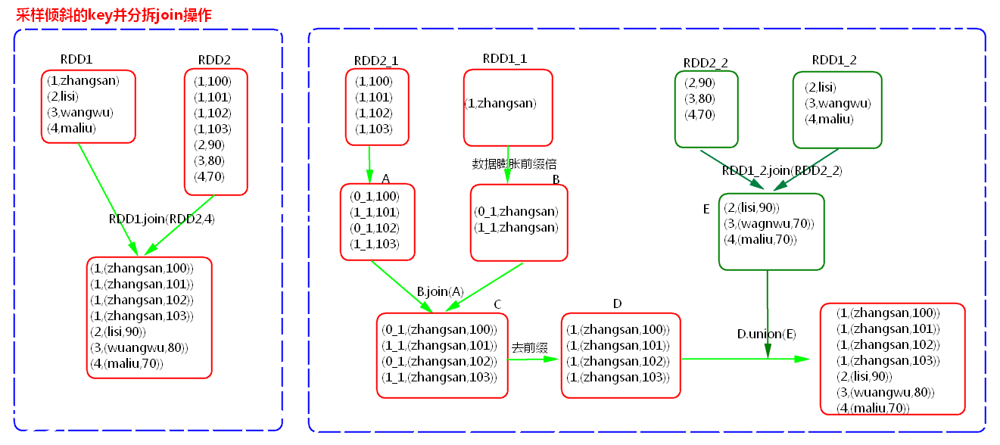
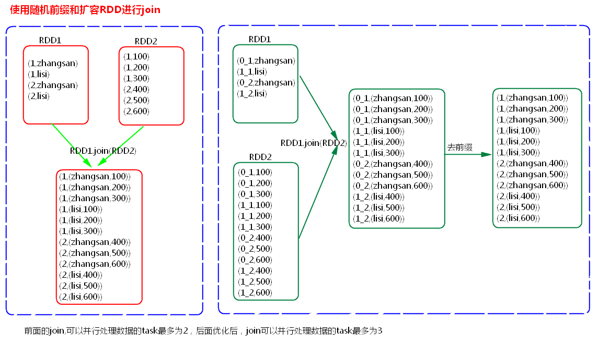

###### Spark 优化

[TOC]

# 资源优化

1. 搭建Spark集群的时候要给Spark集群足够的资源（core，memory）
   
    在spark安装包的conf下spark-env.sh 
    - SPARK_WORKER_CORES
    - SPARK_WORKER_MEMORY
    - SPARK_WORKER_INSTANCE
    
2. 在提交Application的时候给Application分配更多的资源。

   - 提交命令选项：（在提交Application的时候使用选项）
       - `--executor-cores`
       - `--executor-memory`
       - `--total-executor-cores`
   
   - 配置信息：（在Application的代码中设置或在Spark-default.conf中设置）
       - spark.executor.cores
       - spark.executor.memory
       - spark.max.cores
# Spark并行度优化

原则：一个core一般分配2~3个task,每一个task一般处理1G数据（task的复杂度类似wc）

提高并行度的方式：

1. sc.textFile(xx,minPartitions)
2. sc.parallelize(xx,num)
3. sc.makeRDD(xx,num)
4. sc.parallelizePairs(xx,num)
5. reduceByKey,join,distinct
6. repartition/coalesce
7. spark.default.parallelism 
8. spark.sql.shuffle.partitions
9. 自定义分区器
10. SparkStreaming: Direct模式 

# Spark代码优化

1. 避免创建重复的RDD，复用同一个RDD


2. 对多次使用的RDD进行持久化

   **如何选择一种最合适的持久化策略？**

   

   默认情况下，性能最高的当然是MEMORY_ONLY，但前提是你的内存必须足够足够大，可以绰绰有余地存放下整个RDD的所有数据。因为不进行序列化与反序列化操作，就避免了这部分的性能开销；对这个RDD的后续算子操作，都是基于纯内存中的数据的操作，不需要从磁盘文件中读取数据，性能也很高；而且不需要复制一份数据副本，并远程传送到其他节点上。但是这里必须要注意的是，在实际的生产环境中，恐怕能够直接用这种策略的场景还是有限的，如果RDD中数据比较多时（比如几十亿），直接用这种持久化级别，会导致JVM的OOM内存溢出异常。

   

   如果使用MEMORY_ONLY级别时发生了内存溢出，那么建议尝试使用MEMORY_ONLY_SER级别。该级别会将RDD数据序列化后再保存在内存中，此时每个partition仅仅是一个字节数组而已，大大减少了对象数量，并降低了内存占用。这种级别比MEMORY_ONLY多出来的性能开销，主要就是序列化与反序列化的开销。但是后续算子可以基于纯内存进行操作，因此性能总体还是比较高的。此外，可能发生的问题同上，如果RDD中的数据量过多的话，还是可能会导致OOM内存溢出的异常。

   

   如果纯内存的级别都无法使用，那么建议使用MEMORY_AND_DISK_SER策略，而不是MEMORY_AND_DISK策略。因为既然到了这一步，就说明RDD的数据量很大，内存无法完全放下。序列化后的数据比较少，可以节省内存和磁盘的空间开销。同时该策略会优先尽量尝试将数据缓存在内存中，内存缓存不下才会写入磁盘。

   

   通常不建议使用DISK_ONLY和后缀为_2的级别：因为完全基于磁盘文件进行数据的读写，会导致性能急剧降低，有时还不如重新计算一次所有RDD。后缀为_2的级别，必须将所有数据都复制一份副本，并发送到其他节点上，数据复制以及网络传输会导致较大的性能开销，除非是要求作业的高可用性，否则不建议使用。

   

   持久化算子：
   cache:
   	MEMORY_ONLY

   

   persist：
   	MEMORY_ONLY
   	MEMORY_ONLY_SER
   	MEMORY_AND_DISK_SER
   	一般不要选择带有_2的持久化级别。

   

   checkpoint:

   1. 如果一个RDD的计算时间比较长或者计算起来比较复杂，一般将这个RDD的计算结果保存到HDFS上，这样数据会更加安全。
   2. 如果一个RDD的依赖关系非常长，也会使用checkpoint,会切断依赖关系，提高容错的效率。


3. 尽量避免使用shuffle类的算子

   使用广播变量来模拟使用join,使用情况：一个RDD比较大，一个RDD比较小。

   

   join算子=广播变量+filter、广播变量+map、广播变量+flatMap


4. 使用map-side预聚合的shuffle操作

   即尽量使用有combiner的shuffle类算子。

   

   combiner概念：
       在map端，每一个map task计算完毕后进行的局部聚合。

   

   combiner好处：

   1. 降低shuffle write写磁盘的数据量。
   2. 降低shuffle read拉取数据量的大小。
   3. 降低reduce端聚合的次数。

   

   有combiner的shuffle类算子：

   1. reduceByKey:这个算子在map端是有combiner的，在一些场景中可以使用reduceByKey代替groupByKey。
   2. aggregateByKey
   3. combineByKey


5. 尽量使用高性能的算子

- 使用reduceByKey替代groupByKey
- 使用mapPartition替代map
- 使用foreachPartition替代foreach
- filter后使用coalesce减少分区数
- 使用repartitionAndSortWithinPartitions替代repartition与sort类操作
- 使用repartition和coalesce算子操作分区。


6. 使用广播变量

   开发过程中，会遇到需要在算子函数中使用外部变量的场景（尤其是大变量，比如100M以上的大集合），那么此时就应该使用Spark的广播(Broadcast）功能来提升性能。

   

   函数中使用到外部变量时，默认情况下，Spark会将该变量复制多个副本，通过网络传输到task中，此时每个task都有一个变量副本。

   

   如果变量本身比较大的话（比如100M，甚至1G），那么大量的变量副本在网络中传输的性能开销，以及在各个节点的Executor中占用过多内存导致的频繁GC，都会极大地影响性能。

   

   如果使用的外部变量比较大，建议使用Spark的广播功能，对该变量进行广播。广播后的变量，会保证每个Executor的内存中，只驻留一份变量副本，而Executor中的task执行时共享该Executor中的那份变量副本。

   

   这样的话，可以大大减少变量副本的数量，从而减少网络传输的性能开销，并减少对Executor内存的占用开销，降低GC的频率。

   

   广播大变量发送方式：Executor一开始并没有广播变量，而是task运行需要用到广播变量，会找executor的blockManager要，blockManager找Driver里面的blockManagerMaster要。

   

   使用广播变量可以大大降低集群中变量的副本数。不使用广播变量，变量的副本数和task数一致。使用广播变量变量的副本和Executor数一致。


7. 使用Kryo优化序列化性能

   在Spark中，主要有三个地方涉及到了序列化：

   1. 在算子函数中使用到外部变量时，该变量会被序列化后进行网络传输。
   2. 将自定义的类型作为RDD的泛型类型时（比如JavaRDD<SXT>，SXT是自定义类型），所有自定义类型对象，都会进行序列化。因此这种情况下，也要求自定义的类必须实现Serializable接口。
   3. 使用可序列化的持久化策略时（比如MEMORY_ONLY_SER），Spark会将RDD中的每个partition都序列化成一个大的字节数组。

   

   Kryo序列化器介绍：

   Spark支持使用Kryo序列化机制。Kryo序列化机制，比默认的Java序列化机制，速度要快，序列化后的数据要更小，大概是Java序列化机制的1/10。所以Kryo序列化优化以后，可以让网络传输的数据变少；在集群中耗费的内存资源大大减少。 

   

   对于这三种出现序列化的地方，我们都可以通过使用Kryo序列化类库，来优化序列化和反序列化的性能。Spark默认使用的是Java的序列化机制，也就是ObjectOutputStream/ObjectInputStream API来进行序列化和反序列化。但是Spark同时支持使用Kryo序列化库，Kryo序列化类库的性能比Java序列化类库的性能要高很多。官方介绍，Kryo序列化机制比Java序列化机制，性能高10倍左右。Spark之所以默认没有使用Kryo作为序列化类库，是因为Kryo要求最好要注册所有需要进行序列化的自定义类型，因此对于开发者来说，这种方式比较麻烦。

   

   Spark中使用Kryo：

   ```java
   sparkconf.set("spark.serializer", "org.apache.spark.serializer.KryoSerializer")
   sparkconf.set("spark.serializer", "org.apache.spark.serializer.KryoSerializer").registerKryoClasses(new Class[]{SpeedSortKey.class})
   ```


8. 优化数据结构

   java中有三种类型比较消耗内存：

   1. 对象，每个Java对象都有对象头、引用等额外的信息，因此比较占用内存空间。

   2. 字符串，每个字符串内部都有一个字符数组以及长度等额外信息。

   3. 集合类型，比如HashMap、LinkedList等，因为集合类型内部通常会使用一些内部类来封装集合元素，比如Map.Entry。

   因此Spark官方建议，在Spark编码实现中，特别是对于算子函数中的代码，尽量不要使用上述三种数据结构，尽量使用字符串替代对象，使用原始类型（比如Int、Long）替代字符串，使用数组替代集合类型，这样尽可能地减少内存占用，从而降低GC频率，提升性能。

# 数据本地化

## 数据本地化的级别：

1. PROCESS_LOCAL

    task要计算的数据在本进程（Executor）的内存中。

2. NODE_LOCAL

    - task所计算的数据在本节点所在的磁盘上。
    - task所计算的数据在本节点其他Executor进程的内存中。

3. NO_PREF

    task所计算的数据在关系型数据库中，如mysql。

4. RACK_LOCAL

    task所计算的数据在同机架的不同节点的磁盘或者Executor进程的内存中

5. ANY

    跨机架。
## Spark数据本地化调优

Spark中任务调度时，TaskScheduler在分发之前需要依据数据的位置来分发，最好将task分发到数据所在的节点上，如果TaskScheduler分发的task在默认3s依然无法执行的话，TaskScheduler会重新发送这个task到相同的Executor中去执行，会重试5次，如果依然无法执行，那么TaskScheduler会降低一级数据本地化的级别再次发送task。

如上图中，会先尝试1,PROCESS_LOCAL数据本地化级别，如果重试5次每次等待3s,会默认这个Executor计算资源满了，那么会降低一级数据本地化级别到2，NODE_LOCAL,如果还是重试5次每次等待3s还是失败，那么还是会降低一级数据本地化级别到3，RACK_LOCAL。这样数据就会有网络传输，降低了执行效率。

### 如何提高数据本地化的级别？

可以增加每次发送task的等待时间（默认都是3s），将3s倍数调大，	结合WEBUI来调节：

- spark.locality.wait  
- spark.locality.wait.process
- spark.locality.wait.node
- spark.locality.wait.rack

**注意**：等待时间不能调大很大，调整数据本地化的级别不要本末倒置，虽然每一个task的本地化级别是最高了，但整个Application的执行时间反而加长。

### 如何查看数据本地化的级别？
通过日志或者WEBUI

# 内存调优

JVM堆内存分为一块较大的Eden和两块较小的Survivor，每次只使用Eden和其中一块Survivor，当回收时将Eden和Survivor中还存活着的对象一次性复制到另外一块Survivor上，最后清理掉Eden和刚才用过的Survivor。也就是说当task创建出来对象会首先往Eden和survivor1中存放，survivor2是空闲的，当Eden和survivor1区域放满以后就会触发minor gc小型垃圾回收，清理掉不再使用的对象。会将存活下来的对象放入survivor2中。

如果存活下来的对象大小大于survivor2的大小，那么JVM就会将多余的对象直接放入到老年代中。

如果这个时候年轻代的内存不是很大的话，就会经常的进行minor gc，频繁的minor gc会导致短时间内有些存活的对象（多次垃圾回收都没有回收掉，一直在用的又不能被释放,这种对象每经过一次minor gc都存活下来）频繁的倒来倒去，会导致这些短生命周期的对象（不一定长期使用）每进行一次垃圾回收就会长一岁。年龄过大，默认15岁，垃圾回收还是没有回收回去就会跑到老年代里面去了。

这样会导致在老年代中存放大量的短生命周期的对象，老年代应该存放的是数量比较少并且会长期使用的对象，比如数据库连接池对象。这样的话，老年代就会满溢（full gc 因为本来老年代中的对象很少，很少进行full gc 因此采取了不太复杂但是消耗性能和时间的垃圾回收算法）。不管minor gc 还是 full gc都会导致JVM的工作线程停止。


堆内存不足造成的影响：
- 频繁的minor gc。
- 老年代中大量的短生命周期的对象会导致full gc。
- gc 多了就会影响Spark的性能和运行的速度。

Spark  JVM调优主要是降低gc时间，可以修改Executor内存的比例参数。

RDD缓存、task定义运行的算子函数，可能会创建很多对象，这样会占用大量的堆内存。堆内存满了之后会频繁的GC，如果GC还不能够满足内存的需要的话就会报OOM。比如一个task在运行的时候会创建N个对象，这些对象首先要放入到JVM年轻代中。比如在存数据的时候我们使用了foreach来将数据写入到内存，每条数据都会封装到一个对象中存入数据库中，那么有多少条数据就会在JVM中创建多少个对象。

Spark中如何内存调优？
Spark Executor堆内存中存放（以静态内存管理为例）：RDD的缓存数据和广播变量（`spark.storage.memoryFraction 0.6`），shuffle聚合内存（`spark.shuffle.memoryFraction 0.2`）,task的运行（0.2）那么如何调优呢？
1. 提高Executor总体内存的大小
2. 降低储存内存比例或者降低聚合内存比例

如何查看gc？

Spark WEBUI中job->stage->task


# SparkShuffle优化

- spark.reducer.maxSizeInFlight  48M
- spark.shuffle.io.maxRetries 3
- spark.shuffle.io.retryWait 5s
- spark.shuffle.sort.bypassMergeThreshold

# 堆外内存优化

Spark底层shuffle的传输方式是使用netty传输，netty在进行网络传输的过程会申请堆外内存（netty是零拷贝），所以使用了堆外内存。默认情况下，这个堆外内存上限默认是每一个executor的内存大小的10%，最小为384M，真正处理大数据的时候，这里都会出现问题，导致spark作业反复崩溃，无法运行；此时就会去调节这个参数，到至少1G（1024M），甚至说2G、4G。

executor在进行shuffle write，优先从自己本地关联的mapOutPutWorker中获取某份数据，如果本地block manager没有的话，那么会通过TransferService，去远程连接其他节点上executor的block manager去获取，尝试建立远程的网络连接，并且去拉取数据。频繁创建对象让JVM堆内存满溢，进行垃圾回收。正好碰到那个executor的JVM在垃圾回收。处于垃圾回过程中，所有的工作线程全部停止；相当于只要一旦进行垃圾回收，spark / executor停止工作，无法提供响应，spark默认的网络连接的超时时长是120s；如果卡住120s都无法建立连接的话，那么这个task就失败了。**task失败了就会出现shuffle file cannot find的错误**。


1. **那么如何调节等待的时长呢？**

   在./spark-submit提交任务的脚本里面添加：`--conf spark.core.connection.ack.wait.timeout=300`

   如果以上参数没有设置，那么就会使用`spark.network.timeout`参数，默认120s。

   Executor由于内存不足或者堆外内存不足了，挂掉了，对应的Executor上面的block manager也挂掉了，找不到对应的shuffle map output文件，Reducer端不能够拉取数据。


2. **我们可以调节堆外内存的大小，如何调节？**

   在./spark-submit提交任务的脚本里面添加 `--conf  spark.executor.memoryOverhead=2048M`

# 解决数据倾斜

## 使用Hive ETL预处理数据

- 方案适用场景：

    如果导致数据倾斜的是Hive表。如果该Hive表中的数据本身很不均匀（比如某个key对应了100万数据，其他key才对应了10条数据），而且业务场景需要频繁使用Spark对Hive表执行某个分析操作，那么比较适合使用这种技术方案。

- 方案实现思路：

    此时可以评估一下，是否可以通过Hive来进行数据预处理（即通过Hive ETL预先对数据按照key进行聚合，或者是预先和其他表进行join），然后在Spark作业中针对的数据源就不是原来的Hive表了，而是预处理后的Hive表。此时由于数据已经预先进行过聚合或join操作了，那么在Spark作业中也就不需要使用原先的shuffle类算子执行这类操作了。

- 方案实现原理：

    这种方案从根源上解决了数据倾斜，因为彻底避免了在Spark中执行shuffle类算子，那么肯定就不会有数据倾斜的问题了。但是这里也要提醒一下大家，这种方式属于治标不治本。因为毕竟数据本身就存在分布不均匀的问题，所以Hive ETL中进行group by或者join等shuffle操作时，还是会出现数据倾斜，导致Hive ETL的速度很慢。我们只是把数据倾斜的发生提前到了Hive ETL中，避免Spark程序发生数据倾斜而已。
## 过滤少数导致倾斜的key

- 方案适用场景：

    如果发现导致倾斜的key就少数几个，而且对计算本身的影响并不大的话，那么很适合使用这种方案。比如99%的key就对应10条数据，但是只有一个key对应了100万数据，从而导致了数据倾斜。
    
- 方案实现思路：

    如果我们判断那少数几个数据量特别多的key，对作业的执行和计算结果不是特别重要的话，那么干脆就直接过滤掉那少数几个key。比如，在Spark SQL中可以使用where子句过滤掉这些key或者在Spark Core中对RDD执行filter算子过滤掉这些key。如果需要每次作业执行时，动态判定哪些key的数据量最多然后再进行过滤，那么可以使用sample算子对RDD进行采样，然后计算出每个key的数量，取数据量最多的key过滤掉即可。

- 方案实现原理：

    将导致数据倾斜的key给过滤掉之后，这些key就不会参与计算了，自然不可能产生数据倾斜。

## 提高shuffle操作的并行度

- 方案实现思路：

    在对RDD执行shuffle算子时，给shuffle算子传入一个参数，比如reduceByKey(1000)，该参数就设置了这个shuffle算子执行时shuffle read task的数量。对于Spark SQL中的shuffle类语句，比如group by、join等，需要设置一个参数，即spark.sql.shuffle.partitions，该参数代表了shuffle read task的并行度，该值默认是200，对于很多场景来说都有点过小。
    
- 方案实现原理：

    增加shuffle read task的数量，可以让原本分配给一个task的多个key分配给多个task，从而让每个task处理比原来更少的数据。举例来说，如果原本有5个不同的key，每个key对应10条数据，这5个key都是分配给一个task的，那么这个task就要处理50条数据。而增加了shuffle read task以后，每个task就分配到一个key，即每个task就处理10条数据，那么自然每个task的执行时间都会变短了。

## 双重聚合

- 方案适用场景：

    对RDD执行reduceByKey等聚合类shuffle算子或者在Spark SQL中使用group by语句进行分组聚合时，比较适用这种方案。

- 方案实现思路：

    这个方案的核心实现思路就是进行两阶段聚合。第一次是局部聚合，先给每个key都打上一个随机数，比如10以内的随机数，此时原先一样的key就变成不一样的了，比如(hello, 1) (hello, 1) (hello, 1) (hello, 1)，就会变成(1_hello, 1) (1_hello, 1) (2_hello, 1) (2_hello, 1)。接着对打上随机数后的数据，执行reduceByKey等聚合操作，进行局部聚合，那么局部聚合结果，就会变成了(1_hello, 2) (2_hello, 2)。然后将各个key的前缀给去掉，就会变成(hello,2)(hello,2)，再次进行全局聚合操作，就可以得到最终结果了，比如(hello, 4)。
    
- 方案实现原理：

    将原本相同的key通过附加随机前缀的方式，变成多个不同的key，就可以让原本被一个task处理的数据分散到多个task上去做局部聚合，进而解决单个task处理数据量过多的问题。接着去除掉随机前缀，再次进行全局聚合，就可以得到最终的结果。
    
    
    
    如果一个RDD中有一个key导致数据倾斜，同时还有其他的key，那么一般先对数据集进行抽样，然后找出倾斜的key,再使用filter对原始的RDD进行分离为两个RDD，一个是由倾斜的key组成的RDD1，一个是由其他的key组成的RDD2，那么对于RDD1可以使用加随机前缀进行多分区多task计算，对于另一个RDD2正常聚合计算，最后将结果再合并起来。
## 将reduce join转为map join

BroadCast+filter(或者map)

- 方案适用场景：

    在对RDD使用join类操作，或者是在Spark SQL中使用join语句时，而且join操作中的一个RDD或表的数据量比较小（比如几百M或者一两G），比较适用此方案。
    
- 方案实现思路：

    不使用join算子进行连接操作，而使用Broadcast变量与map类算子实现join操作，进而完全规避掉shuffle类的操作，彻底避免数据倾斜的发生和出现。将较小RDD中的数据直接通过collect算子拉取到Driver端的内存中来，然后对其创建一个Broadcast变量；接着对另外一个RDD执行map类算子，在算子函数内，从Broadcast变量中获取较小RDD的全量数据，与当前RDD的每一条数据按照连接key进行比对，如果连接key相同的话，那么就将两个RDD的数据用你需要的方式连接起来。
    
- 方案实现原理：

    普通的join是会走shuffle过程的，而一旦shuffle，就相当于会将相同key的数据拉取到一个shuffle read task中再进行join，此时就是reduce join。但是如果一个RDD是比较小的，则可以采用广播小RDD全量数据+map算子来实现与join同样的效果，也就是map join，此时就不会发生shuffle操作，也就不会发生数据倾斜。

## 采样倾斜key并分拆join操作

- 方案适用场景：

    两个RDD/Hive表进行join的时候，如果数据量都比较大，无法采用“解决方案五”，那么此时可以看一下两个RDD/Hive表中的key分布情况。如果出现数据倾斜，是因为其中某一个RDD/Hive表中的少数几个key的数据量过大，而另一个RDD/Hive表中的所有key都分布比较均匀，那么采用这个解决方案是比较合适的。
    
- 方案实现思路：
  
    对包含少数几个数据量过大的key的那个RDD，通过sample算子采样出一份样本来，然后统计一下每个key的数量，计算出来数据量最大的是哪几个key。然后将这几个key对应的数据从原来的RDD中拆分出来，形成一个单独的RDD，并给每个key都打上n以内的随机数作为前缀，而不会导致倾斜的大部分key形成另外一个RDD。接着将需要join的另一个RDD，也过滤出来那几个倾斜key对应的数据并形成一个单独的RDD，将每条数据膨胀成n条数据，这n条数据都按顺序附加一个0~n的前缀，不会导致倾斜的大部分key也形成另外一个RDD。再将附加了随机前缀的独立RDD与另一个膨胀n倍的独立RDD进行join，此时就可以将原先相同的key打散成n份，分散到多个task中去进行join了。而另外两个普通的RDD就照常join即可。最后将两次join的结果使用union算子合并起来即可，就是最终的join结果	。
    
    
## 使用随机前缀和扩容RDD进行join

- 方案适用场景：

    如果在进行join操作时，RDD中有大量的key导致数据倾斜，那么进行分拆key也没什么意义，此时就只能使用最后一种方案来解决问题了。

- 方案实现思路：

    该方案的实现思路基本和“解决方案六”类似，首先查看RDD/Hive表中的数据分布情况，找到那个造成数据倾斜的RDD/Hive表，比如有多个key都对应了超过1万条数据。然后将该RDD的每条数据都打上一个n以内的随机前缀。同时对另外一个正常的RDD进行扩容，将每条数据都扩容成n条数据，扩容出来的每条数据都依次打上一个0~n的前缀。最后将两个处理后的RDD进行join即可。
    
    


###### THANKS

